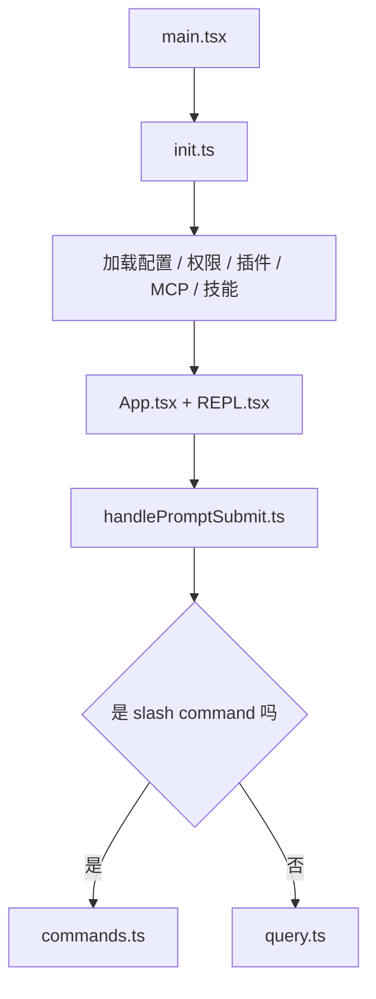
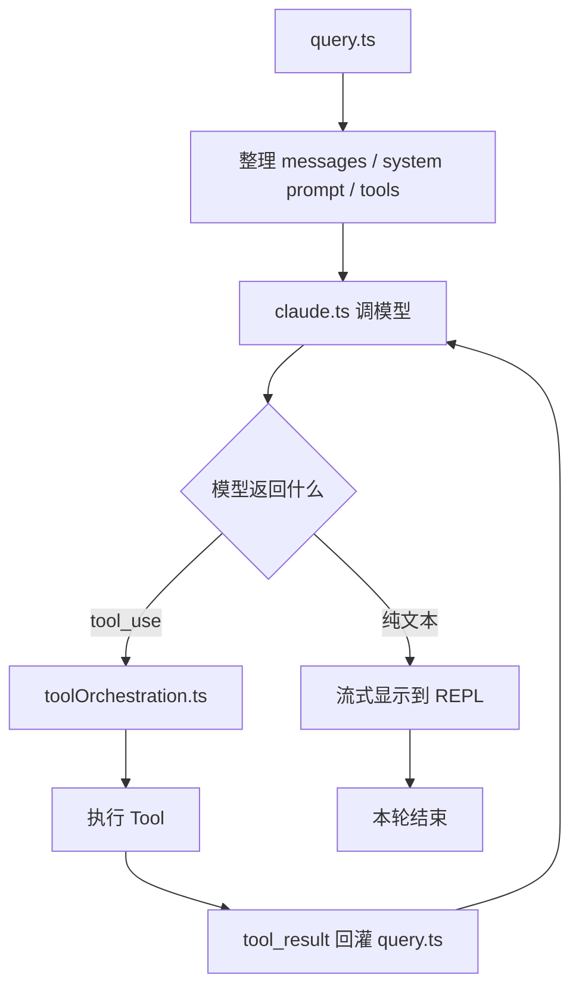
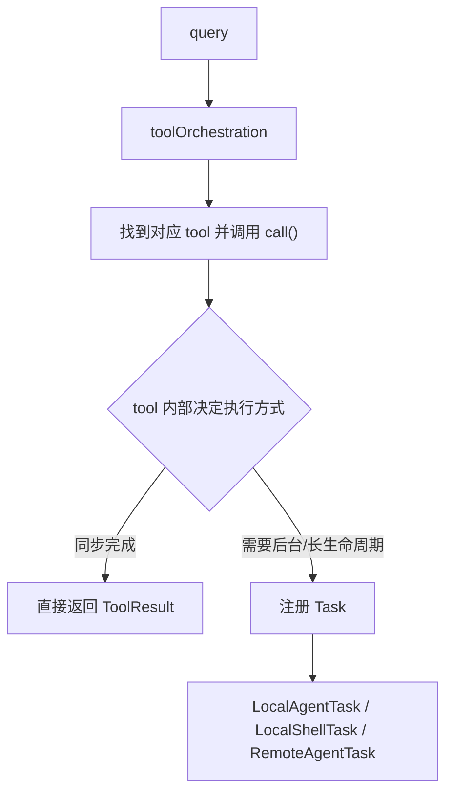
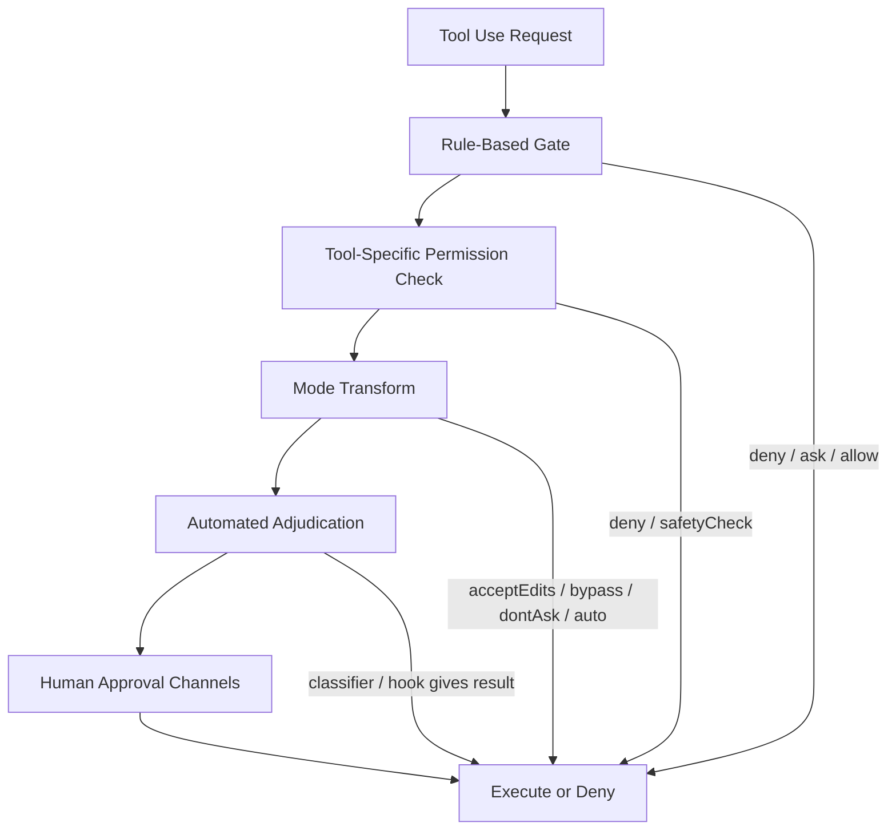

# claude code源码分析


## 目录

- 一. 宏观把握
  - 输入到输入-时序角度
    - 1. 运行外壳、获取输入
      - a. \开头的 **命令**
      - **b. 提示词** 输入 query.ts
    - 2. 输出
      - a. 返回文本
      - b. tool_use
  - 目录架构角度
    - 1. 大模型调用层
    - 2. 上下文控制层
    - 3. 模型能力层
    - 4. 命令控制层
    - 5. 宿主环境层
    - 6. 用户交互层
- 二. 记忆
  - 1. 对话开始前
    - 发现
    - 加工
    - 排序
    - 注入
  - 2. 对话进行时
    - 输入相关
    - 文件触发
  - 3. 每轮对话结束后
    - 触发
    - 筛选
    - 提炼
  - 4. 上下文快满时
    - 平时维护
    - 调用
  - 产出skill
  - 平时使用技巧
- 三. 交互
  - 1. CLI命令与模式分流层
    - **通过“参数改写 + 暂存态”实现入口收敛复用**
    - **通过“生命周期钩子”实现公共初始化复用**
    - **通过“统一命令容器 + 委托处理器”实现命令框架复用**
    - **通过“共享状态载体 + 启动契约”实现模式分流复用**
  - 2. 终端渲染层
    - React => Ink DOM
    - Commit 后 Yoga Layout
    - Yoga Layout => Screen Buffer
    - Screen => Terminal
  - 3. 状态层
    - 全局store
    - REPL本地
    - 外部store
  - 产出skills
  - 平时使用技巧
- 四. 安全
  - 1. cc 到底在防什么
  - 2. 主体是一条可提前返回的决策管线
    - 2.1 规则系统不是简单 allow/deny，而是带 provenance 的策略系统
    - 2.2 tool-specific permission check 才是真正体现“工具语义”的地方
    - 2.3 权限语义转换器
    - 2.4  `safetyCheck`  是 bypass-immune 的硬防线
  - 3. Bash 是最大的安全面，所以用了双轨分析
    - 3.1 AST 路径的重点不是“解析语法树”，而是“能否可信提取 argv”
    - 3.2 它不是只靠 AST，而是 AST 优先 + legacy validator 兼容兜底
    - 3.3 它防的不只是“危险命令”，还防“拆分分析带来的认知偏差”
  - 4. 沙盒不是简单白名单，而是一个 shortcut
    - 4.1 auto-allow with sandbox 的前提是“真的会进 sandbox”
    - 4.2  `excludedCommands`  在源码里明确不是安全边界
  - 5. “AI 分类器”其实有两类，而且源码能证实的内容要谨慎说
    - 5.1 Bash prompt classifier 更像命令级 allow/ask/deny 判断
    - 5.2 auto-mode transcript classifier 更像动作审裁器
    - 5.3 当前仓库里，能直接证实的和不能直接证实的要分开写
  - 6. mode 状态机切换时发生了什么
    - 6.1 auto mode 不是简单开关，而是会“自净化”权限上下文
    - 6.2 bypass 也不是“上帝模式”
  - 7. 审批不是一个弹窗，而是一组并发竞争的通道
  - 8. headless agent 的安全处理
- 彩蛋
  - 宠物
  - KAIROS模式
  - Ultrareview
  - 用户情绪检测
  - 未公开Slash指令列表
- 可视化网站
- 相关链接

“一千个读者就有一千个哈姆雷特”
本蒟蒻写本文只是希望提供一些解读cc源码、窥探智能体开发的视角，还望各位大佬指点
文中在一些地方会附上源码对应的文件名，方便有兴趣的大佬深入研究
同时文末 “**相关链接**” 处会有一系列链接直接跳转到源码的具体位置
如果喜欢叙事风格的可以看 [https://km.sankuai.com/collabpage/2755327017](https://km.sankuai.com/collabpage/2755327017)
配合可视化网站食用更佳 [https://ceilf6.github.io/cc-source/](https://ceilf6.github.io/cc-source/)
## 一. 宏观把握

先从两个角度直观简略感受一下 cc 的工程体系
### 输入到输入-时序角度

模拟用户打开 claude code CLI 然后输入到输出一整个流程
#### 1. 运行外壳、获取输入


用户打开CLI后，入口是 main.tsx ，在这里cc加载配置、初始化插件&MCP&权限，然后拉起 REPL（交互式运行环境）给用户
接着用户输入内容，cc 用 handlePromptSubmit 进行字符串处理，会分流为
##### a. \开头的 **命令**

1) local命令：本地逻辑直接执行
2) local-jsx：本地执行并渲染交互UI
3) type为prompt：例如像 **skills** ，/review，/diff 这些提示词型命令会先用 getPromptForCommand 展开出对应命令的提示词，然后在走 2-query 的逻辑
##### **b. 提示词** 输入 query.ts

那么就开始组织上下文、当前消息、工具列表，接着请求大模型

#### 2. 输出

##### a. 返回文本

那么直接在 REPL 显示
##### b. tool_use

由 toolOrchestration 统一编排，暂停文本输出，找到对应的工具并调用
再由具体的 tool 内部执行时决定是直接同步跑完，还是封装为一个 task 交由 task系统管理
> 一个 task 就类似于一个 全生命周期都被监控的Promise异步任务（Promise只在状态改变时起到取缔占位符的作用、但是task支持运行时的操作能力，例如像进度、能实时发通知等等），有着统一的通知与轮训机制，从而实现了不同类型的后台任务**复用**同一套框架
例如像一个 AgentTool 创建 subAgent ，可以是直接等结果跑完作为函数调用的返回值回传，也可以是注册一个 LocalAgentTask ，等到其完成之后再进入全局消息队列，等待主线程的消费（个人感觉有点像发布订阅模式，但是消息并不是广播的、而是等待被消费）

最终拿到了 tool_result ，但是**不会直接返回 REPL 展示**
而是继续作为 while 循环的下一轮推理入参
> **很多基于大模型和工具调用的智能体，在运行机制上都可以抽象成一个“推理 → 行动 → 观察 → 再推理”的循环；工程实现上常常用 while(true) 循环，有时也会通过控制循环条件实现终止条件、步数上限或工作流控制**
只有在大模型不再调用tool的时候，才会走返回文本的逻辑：break出循环然后展示在 REPL 中
### 目录架构角度

cc 是一个以 agent 运行内核为中心，外挂了命令、工具、任务、UI、协议等等
实现对应功能的目录地图如下
```mermaid
src/
  main.tsx, entrypoints/      启动与初始化
  commands/                   用户命令系统
  tools/ + Tool.ts            模型可调用工具
  tasks/ + Task.ts            后台/长任务
  QueryEngine.ts, query.ts    对话主循环
  services/                   API/MCP/LSP/记忆/压缩等服务
  state/, context/, hooks/    全局状态与上下文
  components/, screens/, ink/ 终端 UI
  skills/, plugins/           扩展机制
  bridge/, remote/, cli/      远程控制与传输适配
  utils/                      基础设施
  constants/, types/          常量与类型
  memdir/, migrations/        记忆与迁移
```
从大模型一层层封装、由内而外分析如下
```mermaid
UI / CLI / Remote 外壳
  -> 会话与运行时容器
    -> 命令控制面（commands / skills / plugins）
      -> 模型能力面（tools / tasks / MCP）
        -> 上下文与约束层（memory / compact / policy / state）
          -> 模型调用内核（query / api）
            -> 大模型
```
#### 1. 大模型调用层

对应文件目录：query.ts、QueryEngine.ts、service/api
身处于最内层，负责直接驱动请求大模型，像常规的一次文本发送、服务器返回就是一次HTTP流，语音处理用WebSocket协议
#### 2. 上下文控制层

控制如何组装请求，也就是暴露什么信息给大模型，对应文件在下
	- services/compact 上下文压缩，在上下文窗口达到上限时自动对早期的上下文进行总结为一段短的摘要
	- services/SessionMemory、memdir/ 记忆相关
	- services/policyLimits 策略限制
	- services/remoteManagedSettings 远程配置
	- state/AppStateStore 权限和全局状态
#### 3. 模型能力层

是建立在 infra基建能力 上的一层能力暴露层，用于拓展大模型的能力，本质就是管理暴露 Function Calling
抽象定义在 Tool.ts 和 Task.ts 中，在 tools.ts 和 tasks.ts 中注册
像 tools/ 提供了文件、bash、MCP、web 等原子能力，tasks/ 提供了之前说的长生命周期的异步任务执行载体
在 toolOrchestration 中实现调度
#### 4. 命令控制层

在 commands 中将 内建命令、skills、plugins、工作流命令 统一装配为用户入口
#### 5. 宿主环境层

通过 bridge、server、cli、bootstrap 实现智能体和运行环境的桥接，管理了会话的生命周期，配合 utils 抹平了不同OS之间的差异
#### 6. 用户交互层

通过 ink 实现了终端中的实时渲染
> 上面粗略把握了 cc 的工程体系，下面进入一些具体的角度
## 二. 记忆

> 我认为在智能体开发、提示词工程中最关键的还是如何处理记忆，毕竟这可是直接关系到大模型对使用者的了解程度、上下文拼接、注意力机制的，故而优先分析
像早期智能体的记忆体系，一般是通过文件进行**静态**管理
如果有具体领域知识，可能还会适配RAG，通过向量数据库召回个性化配置的文档以提高输出质量
但是这种做法很容易导致记忆内容一轮又一轮无筛选的**冗杂**入上下文中
于是后面逐渐通过 **作用范围** 和 **生命周期** 对记忆进行**处理**，例如
	- LangGraph 明确区分 **short-term memory** 和 **long-term memory**
	- OpenAI 的 Conversations / Responses 文档也不是“扔一个文件自己管”那种思路，而是把对话状态持久化为带 durable identifier 的长生命周期**对象**，里面可以存 messages、tool calls、tool outputs 等。也就是说，它关注的是**状态对象**和**上下文继承**
	- 再举个🌰：本蒟蒻开发前端侧智能体时发现，假如一口气将 SDD 文档长时间作为记忆内容会导致每轮对话的token耗散，于是实践着进行生命周期的分离
		- [https://github.com/ceilf6/FrontAgent/commit/eb3985b4a4b5d298c1156594b0353e7c647e0d99](https://github.com/ceilf6/FrontAgent/commit/eb3985b4a4b5d298c1156594b0353e7c647e0d99)
发散了一些关于智能体记忆的背景内容，下面回到 cc 中
cc 的记忆会随着时间在不同**阶段**以不同姿势渗入上下文中
总体可以把握为
1. - 对话开始前 静态装载
2. - 对话进行时 动态补充
3. - 每轮对话结束后 反向沉淀
4. - 上下文快满时 用 session memory 续航
### 1. 对话开始前

作为记忆系统的入口层，可以归纳为：发现 -> 加工 & 排序 -> 注入
主要负责将 **静态、可预装** 的内容塞进上下文
#### 发现

首先，在 claudemd.ts 的 getMemoryFiles 函数中会将所有可用记忆找出来
	- Managed：组织/托管级规则
	- User：用户全局规则
	- Project / Local：从当前目录一路向上扫描 CLAUDE.md、.claude/CLAUDE.md、.claude/rules/*.md、CLAUDE.local.md
	- --add-dir 额外目录
	- AutoMem：长期记忆入口 MEMORY.md
	- TeamMem：团队共享记忆入口 MEMORY.md
#### 加工

具体单个文件怎么读，不在 getMemoryFiles() 里硬写，而是下沉到 claudemd.ts 的 **processMemoryFile**() 
这个函数像一条流水线一样处理“候选记忆文件”、将其加工成可注入的 **MemoryFileInfo**[]
> 候选路径 -> 去重/排除 -> 解析内容 -> 提取 include -> 递归展开 -> 输出结构化对象
它有 6 个核心入参
	- filePath: 当前要处理的文件
	- type: Managed/User/Project/Local/AutoMem/TeamMem
	- processedPaths: 去重集合
	- includeExternal: 是否允许跨出当前项目去 include
	- depth: 当前递归层级
	- parent: 这个文件是不是被别的文件 include 进来的
可以看到，processMemoryFile 并不是一对一读取单一文件内容，而是 DFS 递归地展开一颗 include树
1. - 在进入函数，会立即将路径标准化后查询 processedPaths缓存，防止重复加载
2. - 递归边界：判断 depth >= MAX_INCLUDE_DEPTH ，目前 MAX_INCLUDE_DEPTH 这个常量是 **5**，也就是说**超过5层就断了**，我认为这倡导的是一种 **扁平化**、**可预测** 的记忆体系，宁可广度拓展也不要深度埋藏，力求稳定。在上下文工程中，结构清晰比结构完备更重要
3. - 调用 safeResolvePath 拿到真实目标路径 **resolvedPath** 和 is**Symlink**（是否为**软链接**，例如像 /repo/docs/CLAUDE.md 实际指向 /shared/team-rules/claude.md ）
 > 而在 1 中的路径标准化只是 纯字符串处理，像清理重复分隔符，消除 . 和 .. ，统一大小写
 > 例如像同一**路径**的不同写法在 1 就可以筛出，但是同一个文件**内容**得在 3 去重
 防止了软链接绕过去重，也为下面 @include 打下一个稳定的基准路径
4. - 调用 parseMemoryFileContent 对文件内容进行更细粒度的加工
 	- 只允许白名单文本扩展名，非文本直接跳过
 	- 解析 frontmatter，抽出 paths 变成 globs
 	- 用 lexer 处理 HTML 注释
 	- 从 markdown 文本里提取 @include
 	- 如果是 AutoMem/TeamMem 的 MEMORY.md，还会截断，防止上下文爆炸
 	- 如果内容被改写过，会记录 contentDiffersFromDisk/rawContent
5. - 将当前文件内容放入结果，然后递归调用 **processMemoryFile **处理其 @include 的子文件
 > 和 React 的 FiberTree 一样，会专门用 parent 字段存储 filePath 确保每个 MemoryFileInfo 都知道自己是被谁 include 进来的
 > 同时源码 claudemd 中注释了 “includes first, then main file” 但是实际实现我看是 “父文件先、子文件后” ，这点是我看错了、还是 cc 的“防御性编程”？
6. - 最后产出 MemoryFileInfo 
	- path
	- type
	- content
	- parent
	- globs
	- contentDiffersFromDisk
	- rawContent
像后面注入时 getClaudeMds 会用到 content/type/path
条件规则匹配会用到 globs
include 关系和 UI/缓存逻辑会用到 parent/rawContent
#### 排序

> 上面的“加工”就是排序过程中文件的具体过程，“排序”是宏观上的把握
和 RAG 一样，为了提高模型的生成质量，cc 对召回的记忆按照**优先级**进行排序，具体规则是
> 个人感觉有点像CSS层叠优先级的思想，都是越特殊的越优先，上下文中的优先就是越晚进入（这点在下面展开）
	- 越**通用**的，越早进
	- 越贴近**当前工作目录**的，越晚进
	- 越新的、越**个性化**的上下文，越晚进
> 但是 RAG 是先一口气召回所有文档，然后例如通过重排序器的交叉编码器对初级文档进行**精准**排行，中间还可以用 topK 等算法
> 但是 cc 的排序就很直接，是通过 **装载顺序** 实现前后区分的，就像一个队列一样
在源码中具体体现为 push Managed -> User -> 从根目录往当前目录递归扫描Project/Local -> AutoMem/TeamMem
即 组织 -> 用户 -> 仓库规则 -> 当前目录附近规则 -> 长期记忆
注意，如上面加工过程：Project/Local 是从根往当前目录“向下”靠的，也就是说离当前目录越**近**的规则会越靠后、越“贴脸”
而 **后面的上下文对模型输出的控制力相对更强** ，一是由于Transformer的注意力机制，二是由于语言模型的生成偏置（猜词接龙）
#### 注入

1. - loadMemoryPrompt 函数注入的是 记忆机制说明 ，也就是模型该怎么使用和写 memory 
2. - getMemoryFiles() -> getClaudeMds() 注入的才是 记忆内容本身，也就是上面 processMemoryFile 加工后的记忆文件内容**MemoryFileInfo**[]
通过这种将 记忆规则 和 记忆内容 拆分的设计，确保了 claude code 的记忆体系不混乱，因为是先告诉模型“什么是记忆”然后再输入内容
### 2. 对话进行时

在对话进行时，cc 的记忆体系不会重建整包memory，而是将“当前问题最相关的记忆”以 **attachment** 的方式动态渗进上下文，目的就是在“对话开始前”静态预装的上下文基础上做**动态补充**
可以分为两条**并行**链路，分别从 **用户输入** 和 **当前文件** 两个角度进行补充上下文
#### 输入相关

按照用户**输入**的prompt，临时补充最相关的长期记忆
	- 每轮对话开始时，在 query.ts 和 attachments.ts 就会启动一个异步预取，不阻塞主流程
	- 会先扫描 memory 目录里除 MEMORY.md 之外的 memory 文件**头部信息**，只读 **frontmatter** 和**描述**（就像 skills 的** 元数据** 一样）
	- 然后用一个 side query 让 **Sonnet** 从这些候选里挑最多 5 个“当前用户输入问题明显有用”的 memory（本质还是一个提示词工程）
	> sideQuery.ts 中是一个脱离主对话循环的轻量独立模型请求，不是subAgent、没有自己的上下文，只是借模型做一个**旁路判断**
	- 如果用户消息里 @ 了某个 agent，就只搜这个 agent 的 memory 目录；否则默认搜 auto memory
	- 预取结果只在“已经算完”时才会被消费，变成 relevant_memories attachment 注入当前 query loop
#### 文件触发

这条线并不是按照用户输入问题语义召回，而是按照当前**文件**上下文召回“**嵌入**”记忆nested memory
像 **IDE打开的**、**@提到的** 文件都会触发，调用 getNestedMemoryAttachmentsForFile 函数，该函数会找该文件路径相关的 memory/rules：
	- Managed/User 的条件规则
	- 从 CWD 到目标文件路径之间各层目录的 CLAUDE.md、普通 rules、条件 rules
	- root 到 CWD 这一段上的条件 rules
> **CWD** - **Current Working Directory 当前工作目录**
其内部利用的是上文提到的 **processMemoryFile **进行递归
### 3. 每轮对话结束后

在对话结束后自然而然就是聚焦于本轮交互是否有值得记忆的内容，本质就是一条反向持久化链
总体上可以分为 4 步：触发 -> 筛选 -> 提炼 -> 写回
#### 触发

每次完整 query loop 结束后，handleStopHooks() 会启动后台 bookkeeping；如果开着 EXTRACT_MEMORIES 且当前是**主线程**，就 fire-and-forget 调 executeExtractMemories()
> 因为需要是主线程，所以 **subAgent 是无法直接影响主记忆的**，只有在 子智能体 的结果在回流到主智能体并且经过筛选后才能被沉淀到主memory
#### 筛选

并不会每轮都无脑提炼，而是先过几道门
	- 判断**功能是否存在、功能是否开启、当前环境是否允许写入**：feature gate、auto memory enabled、非 remote mode
	- 避免**并发**，防止竞态问题导致的混乱：如果上一轮提炼还没跑完，就不并发开第二个，而是把最新 context stash 起来，等当前 run 结束后补一个 trailing run
	- 确保是**增量**提炼：有一个**游标 lastMemoryMessageUuid**，只处理“上次提炼之后**新增的消息**”
	> 成功或主线程已直写 -> 前移
	> 失败 -> 不动
	> 并发到来 -> stash，随后按新边界补差量
#### 提炼

将上面经过筛选后的候选内容进行提炼
	- 首先要确定**已有**哪些memory、防止重复造轮子：扫描已有 memory 文件头，做成 **manifest**，像一个索引视图，避免 agent 浪费 turn 去 ls
	- 再拼 extraction prompt，通过提示词工程**明确要求“只根据最近这批消息提炼，不要再去查代码/grep/git 验证”**，限定了大模型的活动边界与行为（有点SDD的思想）
上面拿到的了提炼材料和作业说明，后面在 agent 中进行进一步的**提炼、执行写回**操作
	- 真正的提炼执行写回的过程不是主线程自己做，而是 fork 一个后台 memory extraction agent：用 runForkedAgent() 跑**后台 agent**，复用主会话 cache，但限制工具**权限**。既起到了隔离环境的效果，还不会打扰主任务，**防止污染当前对话上下文**
	> 我感觉类似于 Git flow 的 **develop** 分支的效果
### 4. 上下文快满时

在 /compact 或者 自动compact触发 时并不是临时现做摘要，而是优先拿“平时已经维护好的 **session memory**”来做 **compact**
> 自动触发条件是：
> 	- 先达到初始化 token 阈值
> 	- 后续再达到“token 增长阈值”
> 	- 再结合工具调用次数，或等到一个没有 tool call 的自然断点
#### 平时维护

sessionMemory.ts 会在主线程每轮结束后，按阈值后台维护一份“当前会话笔记文件”，不是等快满了才开始写
后台维护 session memory 的方式，和“每轮结束后”**提炼**长期记忆很像，但目标完全不同：
	- 它只跑**主线程** repl_main_thread，不跑 subagent
	- 它会先准备 session memory 文件，如果没有就按模板创建
	- 然后用 runForkedAgent() 跑一个后台 agent，但**权限极窄**，只允许对这个**唯一的 notes 文件**做 Edit
	- prompt 明确要求它保持模板结构，只更新各 section 内容，比如 Current State、Files and Functions、Errors & Corrections
所以不同于之前维护的长期知识库，session memory 是这次对话的**高密度工作笔记**
#### 调用

核心函数为 trySessionMemoryCompaction **优先使用 session Memory** ，只有在其无法使用或者为空时才会 fallback 到 **compact**：**传统摘要式压缩流程**，临时把当前整段对话重新总结一遍
### 产出skill

学习了 cc 记忆体系的架构与工程原则：
	- **四阶段时间主线**
	- **规则与内容分离**
	- **启动前的装配线思维**
	- **运行中的双通道 recall**
	- **回合结束后的反向持久化链**
	- **durable memory 和 session memory 分家，并用 session memory 为 compact 续航**
	- **预算意识**
	- **不阻塞主线，失败就降级**
	- **subagent隔离**
我产出了一个用于在智能体项目中优化其记忆系统的skill
	- Friday skill 链接 [20ec1b7ca9](https://friday.sankuai.com/skills/skill-detail?activeTab=overview&id=28144)
	- github 链接 [https://github.com/ceilf6/ceilf6-skills/tree/main/agent-memory-optimizer](https://github.com/ceilf6/ceilf6-skills/tree/main/agent-memory-optimizer)
并实践应用于优化 FrontAgent 的跨会话记忆体系 [https://github.com/ceilf6/FrontAgent/commit/d4b06286a70604a53734d02ced00d4daef172c43](https://github.com/ceilf6/FrontAgent/commit/d4b06286a70604a53734d02ced00d4daef172c43)
（目前还没有时间去测试，后面会对照分析更新前后的输出质量进而判断记忆召回的效果）
### 平时使用技巧

根据上面通过源码后知道的特性，启发了一些平常使用技巧
**配置层**
	- 把 `CLAUDE.md` 写到“**只**保留 Claude 真会做错的事”这个程度。源码里 `/init`** 就是按“删掉这一行会不会让 Claude 犯错”来生成的**，太大的 `CLAUDE.md` 还会被直接标 warning
	- 把**团队**共享规则和个人偏好分开。团队级放项目 `CLAUDE.md` / `.claude/rules/`，个人习惯放 `CLAUDE.local.md` 或 `~/.claude/CLAUDE.md`，这样既不污染仓库，也更符合加载顺序
	- monorepo 或多模块项目，别指望一个总 `CLAUDE.md` 解决全部问题。给**子**目录加自己的 `CLAUDE.md`，或者把 `.claude/rules/*.md` 做成按 `paths` 命中的局部规则，效果会比全局大杂烩稳定得多
	- 长文档、易变文档、API 参考**不要硬塞**进 `CLAUDE.md`，改成 `@path/to/file` 这种按需引入；这样启动上下文更轻，也不容易过期
**提问层**
	- 让 Claude Code 围绕“**具体文件/目录/模块”工作**，而不是只给抽象目标。它运行中会按当前文件路径补 `nested memory`，所以“改 `src/foo.ts` 里的 X”通常比“帮我改下这块逻辑”更容易触发对的局部规则
	- 真想让它跨会话记住，直接说“**记住这个**”；真想撤销，直接说“**忘掉这个**”。turn-end extraction 的提示词对这种**显式信号是有专门处理的**
	- 需要**手工修记忆时直接用 **`/memory`，它会打开 memory 文件让你改，而且走的是你的 `$EDITOR` / `$VISUAL`。这比在对话里绕着说“帮我看看现在都记了什么”更可控
	- 少让它吐大块输出。源码里专门把大 `bash`/`read`/`grep`/`webfetch` 结果视为 context bloat，所以平时多说“**先定位，再只读相关片段**”，少说“把整个文件/日志/网页贴给我看”
**长会话层**
	- 想要长会话连续性，尽量开着 `autocompact`。因为 `session memory` 的后台维护本身就尊重 auto-compact 开关，关掉以后连续性能力会弱很多
	- 真要 `compact` 时，优先用**裸 **`/compact`。因为只要你不给自定义总结指令，它就会优先走 `session-memory compaction`；一旦写成 `/compact 请重点总结...`**，就会回退到传统 compact**
	- 不要等快爆上下文了再救火。源码里 80% 容量就会开始提示你尽快 `/compact`，所以长任务最好在你还掌控上下文时**主动压**一次
	- 如果大量用 **subagent**，结束前**让主线程再收口一次**。因为**subAgent 是无法直接影响主记忆的**，自动长期记忆提炼由主线程负责，subagent 的发现最好回流给主线程后再让它总结、记住
大体上宗旨是：`规则写小、任务锚到文件、记忆显式说、长会话尽早主动 compact`
## 三. 交互

下面我想从将 claude code 视为 CLI **产品**的角度出发，看看能从其交互式系统中学习到哪些可以借鉴的思维
首先从宏观上我分为三层
1. - CLI命令与模式分流层：用户如何从外部进入系统，并被分流到正确的执行模式
2. - 终端渲染层：运行时状态如何被声明式地渲染为终端 UI
3. - 状态层：状态本身如何被组织、隔离和驱动更新
### 1. CLI命令与模式分流层

首先最外层是关注如何从**外部**进入 claude code，同时分流到正确的执行模式（至于 claude code 中例如 /theme 等等是属于 内部命令，在“应用基础设施层”展开）
我认为这一层可以学习的是其如何尽可能多实现**复用**的设计。因为 claude code CLI 支持的命令参数有很多，如何将可复用的内容固定、对差异处进行可维护的管理，想必也是各位大佬写代码很关注的一件事情
#### **通过“参数改写 + 暂存态”实现入口收敛复用**

实现方式：先在 main() 很前面解析特殊输入，把**信息**存进 _pendingConnect、_pendingAssistantChat、_pendingSSH，必要时直接改写 process.argv，然后继续走默认主流程。
	- 复用了 cc:// 的 interactive 入口：不是单独再做一套“直连 TUI 启动器”，而是把 URL 暂存后继续走默认 claude [prompt] 主线，后面统一进入 launchRepl(...)。
	- 复用了 cc:// + -p 的 headless 入口：不是重新实现一套 headless 直连解析，而是把它改写成内部 open <cc-url> 子命令，复用已有 open 处理逻辑。
	- 复用了 claude assistant [sessionId] 的交互入口：把 assistant 从 argv 里剥掉，后面仍走主交互路径，而不是再维护一套独立 UI 启动链。
	- 复用了 claude ssh <host> [dir] 的交互入口：先抽取 host/dir/flags 到 _pendingSSH，后面再在主 action 里统一决定怎么进入 REPL。
#### **通过“生命周期钩子”实现公共初始化复用**

实现方式：用 program.hook('preAction', ...) 把所有外层命令**共享的前置步骤挂成统一生命周期**，而不是散落在每个命令的 .action(...) 里。
	- 复用了 init()：默认命令和各类子命令都共用同一套基础初始化。
	- 复用了 logging sinks 初始化：避免每个子命令自己补日志接线。
	- 复用了 migration 流程：通过 runMigrations() 统一执行，而不是每个命令各自判断。
	- 复用了 remote settings / policy limits 的预热加载：命令层统一做，后面的 action 只拿结果。
	- 复用了 entrypoint 标记逻辑：initializeEntrypoint(...) 统一设置 CLAUDE_CODE_ENTRYPOINT，而不是每条分支各写一遍。
#### **通过“统一命令容器 + 委托处理器”实现命令框架复用**

实现方式：整个外层 CLI 只有一个 CommanderCommand 根对象，默认命令和子命令都挂在**同一棵命令树**下；复杂子命令再把具体逻辑**委托**给外部 handler。
也就是说命令层只做了组织和分发，复杂的执行并不会耦合在其中而是交给专门处理器
Simple 单一职责原则
	- 复用了 Commander 的解析/帮助/选项继承能力：比如 help 配置、根级 option、preAction 生命周期，不需要每个子命令重复造壳。
	- 复用了默认命令和子命令的统一注册机制：program.argument(...).action(...) 和 program.command(...).action(...) 都挂在同一个程序骨架上。
	- 复用了 handler 模块：例如 mcp 系列子命令在命令树里只负责路由，实际执行交给 cli/handlers/*，这样 main.tsx 不需要塞满业务细节。
	- 复用了命令注册片段：像 registerMcpAddCommand(...) 这种，把某一组子命令注册逻辑抽出来复用，而不是在 main.tsx 手写到底。
#### **通过“共享状态载体 + 启动契约”实现模式分流复用**

实现方式：把跨阶段要共享的数据装进统一对象，再让**多个模式分支共用同一套启动接口和上下文**。
	- 复用了 Pending* 状态对象：早期 argv 预处理阶段和后面的默认 action 阶段，不直接相互耦合，而是通过 _pendingConnect / _pendingSSH / _pendingAssistantChat 传递状态。
	- 复用了 sessionConfig：continue、resume、direct connect、ssh remote、remote 等交互分支，都尽量从同一个基础配置对象出发，只覆盖少量差异字段。
	- 复用了 resumeContext：多个恢复相关路径共享同一份恢复上下文，而不是每个恢复分支各自重新拼上下文。
	- 复用了 interactive 启动骨架：createRoot(...) -> showSetupScreens(...) -> launchRepl(...) 这条链，被多种交互模式共用。相关 helper 在 interactiveHelpers.tsx 和 replLauncher.tsx。
	- 复用了 headless 启动准备：虽然最后走的是 runHeadless(...)，但前面的 setup()、env 应用、hooks 启动、校验逻辑，和 interactive 共享了大量准备阶段。
### 2. 终端渲染层

从终端进入对话之后，问题就是：如何渲染
	- 浏览器中如果是 React 应用那么就是通过：React FiberTree -> React DOM -> Real DOM -> Browser
	- cc 的 TUI 是走的：React FiberTree -> Ink DOM -> Yoga Layout -> Screen Buffer -> Terminal
可以看到在 **render 的 reconcile** 阶段，React 仍然用同一套 Fiber/reconciliation 机制计算更新，例如像递归收集flags、diff计算等等；到了 **commit** 阶段，不再由 React DOM 把更新提交到浏览器 DOM，而是由 **Ink** 作为 **renderer** 把更新提交到它自己的终端宿主节点树，再交给 Yoga 做布局并输出到 terminal
#### React => Ink DOM

在 ink/ink.ts 中以 Ink.render(node) 为入口，调用 `react-reconciler` 的 `updateContainerSync + flushSyncWork`，触发 React 的 reconcile 中 beginWork递、completeWork归 收集flags
在 ink/reconciler.ts 中，Ink 通过 createReconciler 方法注册了一整套 host 方法，把 React 在 **commit 阶段**产生的宿主操作，逐条映射为对 **Ink DOM** 的 mutation，并同步 **Yoga 节点状态**（如 style、display、子节点结构等）
> **HostConfig** 是提供给 React 的一个**对象**，通过对象中提供的一系列**方法**，告诉 reconciler 在目标宿主环境里“怎么创建节点、怎么挂子节点、怎么更新、怎么提交”。这个宿主环境可以是 DOM、canvas、console，也可以是终端 UI
> Ink HostConfig 就相当于 React 在 终端环境 中的一个**适配器**
Ink HostConfig 对象包含的方法有如
	- `createInstance / createTextInstance`：创建 Ink DOM 节点（并按需创建/配置 Yoga 节点）
	类似于在浏览器中 display: none 的DOM节点是不配在布局树中拥有节点的，`ink-virtual-text` / `ink-link` / `ink-progress`这几类 Ink DOM 节点无需创建对应的 Yoga 节点
	- `appendChild / insertBefore / removeChild`：维护 Ink DOM 树结构，同时维护 Yoga child 列表（注意无 Yoga 节点的 child 会影响索引映射）
	- `commitUpdate / commitTextUpdate`：把 props/text 变更写入 Ink DOM；对影响布局的 style/display 等变更同步到 Yoga 节点状态（例如 `applyStyles`、`setDisplay`） -（初次挂载时）`createInstance` 内部会遍历 props 做初始化写入（Ink 内部用 helper 处理不同 prop 类别）
在 commit 的收尾时有一个钩子，会触发
1. - rootNode.onComputeLayout()
2. - rootNode.onRender?.()
这两条分别对应下面的 
	- Yoga Layout
	- 调度 frame render 使用新的 computed layout 画进 screen buffer
从 2 是在 1同步执行 之后，确保了消费数据是在数据更新之后，这也就是为什么是 Yoga Layout => Screen Buffer
> 有点像浏览器的**单线程**事件循环中 JS 执行DOM影响布局信息会**同步阻塞** HTML 解析
#### Commit 后 Yoga Layout

这一层主要聚焦于在拿到前面输入得到的元素几何信息计算“几何树”，包含每个 Yoga节点 的盒模型信息等等
我们可以主要关注其在性能优化方面的处理：类似于 React FiberTree 中有 **didReceiveUpdate **字段实现 eagerState、bailout 等性能优化策略，cc 通过 dirty 和 measure 细化了重渲染的粒度，实现了尽可能多的节点复用
	- dirty（Ink DOM）**: DOMElement.dirty**，决定 paint 阶段能否直接 blit 复用上一帧像素；`dirty=false` 允许快路径，`dirty=true` 迫使该子树重画
> blit: Block Image Transfer 块拷贝，在图形系统中表示将一块已经画好的像素区域直接复制到另一个地方，而不是重新绘制一遍。在 cc 的 TUI 场景中表示 把上一帧 screen buffer 里的一块 cell 矩形，直接复制到这一帧
	- measure（Yoga）: `ink-text/ink-raw-ansi` 这两类特定节点通过 `setMeasureFunc` 参与 Yoga 尺寸求解；当 Ink 在 `markDirty` 中对这些节点触发 `yogaNode.markDirty()` 时，会让 commit 后的 `calculateLayout` 重新进行昂贵的文本测量与换行推导
1. - 尽可能避免 dirty
 1. - `children`** 不参与 attribute 更新**
  因为 React 会给 `children` 传新引用；如果当 attribute，会导致每次都 `markDirty`。
 2. - `style`** 做值相等比较，避免每 render 触发 dirty**
  React 经常每次 render 都 `style={{...}}` new object。Ink 在 `setStyle` 里做 shallowEqual，避免无意义 `markDirty`
2. - **makeDirty** **只**对需要 re-measure **叶子**（确保是第一次遇到的）也就是我上面提到的 ink-test、ink-raw-ansi 两类节点触发 Yoga dirty
 ```typescript
 if (
   !markedYoga &&
   (current.nodeName === 'ink-text' || current.nodeName === 'ink-raw-ansi') &&
   current.yogaNode
 ) {
   current.yogaNode.markDirty()
   markedYoga = true
 }
 ```
 实现只有在 文本节点变动 才会把 脏标记 “打穿”触发昂贵的 measure
> 或许可以借鉴 [https://github.com/chenglou/pretext](https://github.com/chenglou/pretext) 思路优化 measure 过程？但是终端环境没有canvas环境并且测量对象一个是像素宽度一个是cell宽度，所以有人建议给 `prepare()` 加可插拔 `measure`，改成用 `string-width` 这类 cell 计数函数，具体可看[https://github.com/chenglou/pretext/issues/34](https://github.com/chenglou/pretext/issues/34)
#### Yoga Layout => Screen Buffer

当 Yoga 的 computed layout 已经可读后，renderer 开始消费这棵由 Ink DOM + Yoga node 组成的布局树（如果布局不存在的话会做防御，返回空frame，等到下次触发时再更新）
首先以 createRenderer 为入口，和 React 一样也用了 ping-pong **双缓冲**，目的是实现复用 Output实例（保留charCache等跨帧缓存）以降低分配与重复解析成本，然后通过布局树中根节点的 computed 尺寸确定本帧 screen 的宽高
接着进入核心递归 renderNodeToOutput ，对每个节点读其 computed rect ，判断当前节点子树能否复用上一帧对应矩形，具体用到的就是上一步拿到的 dirty 标记`若 node.dirty=false 且 rect 未变且 prevScreen 存在`那么就直接 blit 复用
核心思想和**虚拟树**一样，都是要通过先在**内存**中处理避免昂贵的开销，例如在 cc 的 TUI 中要避免的就是频繁触碰终端 I/O ，于是先将渲染结果落到**内存**中，和上一帧做比较、尽可能复用，为下一层基于 `Screen` 计算最小 patches 并写入终端做准备
#### Screen => Terminal

LogUpdate 将 prevFrame, frame.screen => 终端变更的最小patch序列
`writeDiffToTerminal` 把 patch 列表变成一次或少数几次 `stdout.write(...)`，并按终端能力决定是否包裹 **DEC 2026 同步输出**（BSU/ESU）来避免闪烁/撕裂
在交互上的体验优化措施可以归纳为：
	- **把 diff 的副作用压缩成少量 write**（减少 I/O 调用和终端重绘抖动）
	- **在支持时用同步输出保证原子性**（避免用户看到中间态）
	- **在不支持/被 tmux 破坏原子性时跳过**（避免徒增开销或错误行为）
### 3. 状态层

在知道状态如何驱动渲染更新后，现在聚焦于状态是怎么管理的
cc 并不是直接只用一个大的全局store例如 Redux 一口气收口所有状态
而是将状态按照 **频率**和**职责** 拆开了
	- 实现了 高频脏数据 与 低频共享壳层 的区分，防止高频刷新时无效的性能耗散
	- 像 React16 引入 Scheduler 一样，**缩小了更新的颗粒度**，实现了例如 messagesRef 这种需要立即可读的状态 不用等 React batching（在"REPL本地"中详细展开）
	- 并且职责不同决定了生命周期的不同，像 AppState是会话session级别，REPL本地状态是当前REPL实例级别的
拆分为下面三种状态，最后再统一交给 React+Ink 渲染
#### 全局store

全局 store 也就是 **AppState** ，承载的是会话级、共享的交互壳层状态，例如共享 UI、权限模式、MCP、插件、任务视图、footer、通知等。
在 main.tsx 中准备了 initialState ，由 launchRepl 传入到 App 后挂在了 AppStateProvider 上，这也就印证了我上面说的 AppState是顶层、会话级别的
AppStateProvider 放进 Context 的不是不断变化的 AppState，而是稳定的 store 引用，从而避免 Context value 变化导致整棵树级联重渲。
其底层实现是基于**观察者模式**：
```typescript
type Store<T> = {
  getState: () => T
  setState: (updater: (prev: T) => T) => void
  subscribe: (listener: Listener) => () => void
}
```
当 setState 更新 store 后，会通知订阅者；React 侧再通过 Context + useSyncExternalStore + selector 订阅并读取切片，只有选中值真正变化的组件才会重渲。
同时，onChangeAppState 作为 AppState 副作用的统一收口层，负责把持久化、模式同步、环境刷新等系统行为集中处理。
#### REPL本地

本地状态管理的是高频且强时序的状态，最核心的是 messages、streaming text/tool use、输入框、overlay、滚动相关。这些**更新极高频**，而且强依赖当前 REPL 生命周期，所以放在本地
正由于其高频更新的特性， cc 通过 useState + useRef 去维护，确保读取到的是**最新值**
以 messages 为例 REPL.tsx (line 1182)
```typescript
const [messages, rawSetMessages] = useState<MessageType[]>(initialMessages ?? []);
const messagesRef = useRef(messages);
const setMessages = useCallback((action: React.SetStateAction<MessageType[]>) => {
  const prev = messagesRef.current;
  const next = typeof action === 'function' ? action(messagesRef.current) : action;
  messagesRef.current = next;

  if (next.length < userInputBaselineRef.current) {
    userInputBaselineRef.current = 0;
  } else if (next.length > prev.length && userMessagePendingRef.current) {
    const delta = next.length - prev.length;
    const added =
      prev.length === 0 || next[0] === prev[0]
        ? next.slice(-delta)
        : next.slice(0, delta);

    if (added.some(isHumanTurn)) {
      userMessagePendingRef.current = false;
    } else {
      userInputBaselineRef.current = next.length;
    }
  }

  rawSetMessages(next);
}, []);
```
1. - messages 给 React 渲染用。
2. - messagesRef 给“同步立即读取最新值”的逻辑用。
> 对action做束口这部分有点像 Reducer模式 ？我记得 useReducer 和 useState 本质区别就是处理函数一个是自定义的一个是React定义的
#### 外部store

管理**跨 React/非 React** 的流程状态，像命令队列、QueryGuard、任务文件 watcher 都属于这类。它们既要被 React 订阅，又要被非 React 代码同步读写，所以独立出来最干净
具体实现是通过 模块级真相源 (如commandQueue等) + 订阅通知 + useSyncExternalStore 桥接 React
在 signal.ts 中通过 createSignal 维护 listener 集合
```typescript
export function createSignal<Args extends unknown[] = []>() {
  const listeners = new Set<(...args: Args) => void>()
  return {
    subscribe(listener) {
      listeners.add(listener)
      return () => listeners.delete(listener)
    },
    emit(...args) {
      for (const listener of listeners) listener(...args)
    },
    clear() {
      listeners.clear()
    },
  }
}
```
listener集合会在变化时 emit，本质仍然是观察者模式，它并不负责存储状态快照，而是负责管理订阅、广播事件，真正的外部 store 是在它上面再包一层自己的状态和 getSnapshot()
例如像命令队列commandQueue
```typescript
const commandQueue: QueuedCommand[] = []
let snapshot: readonly QueuedCommand[] = Object.freeze([])
const queueChanged = createSignal()
```
其中 commandQueue 是真实可变数据，**snapshot** 是提供给 **React** 的只读快照，queueChanged 负责在队列变化时通知订阅者。React 侧通过 useSyncExternalStore(subscribe, getSnapshot) 订阅它；而非 React 代码则可以直接调用 enqueue、dequeue、peek 等同步 API 读写这份模块级状态。
### 产出skills

1. - 审计和设计 AI Agent CLI 的多模式入口架构：快路径检测、生命周期钩子、入口收敛复用、可扩展命令注册表
 	- [https://github.com/ceilf6/ceilf6-skills/tree/main/agent-cli-architect](https://github.com/ceilf6/ceilf6-skills/tree/main/agent-cli-architect)
 	- [20ec1b7ca9](https://friday.sankuai.com/skills/skill-detail?activeTab=overview&id=30967)
2. - 审计和优化 React-based 终端 UI 渲染管线：HostConfig 适配器、脏标记+块拷贝增量渲染、终端 I/O 原子性防闪烁
 	- [https://github.com/ceilf6/ceilf6-skills/tree/main/tui-render-optimizer](https://github.com/ceilf6/ceilf6-skills/tree/main/tui-render-optimizer)
 	- [20ec1b7ca9](https://friday.sankuai.com/skills/skill-detail?activeTab=overview&id=30974)
3. - 设计流式 AI Agent 界面的分层状态架构：三级状态分层(全局/本地/外部)、集中式副作用处理器、跨 React/非React 边界状态桥接
 	- [https://github.com/ceilf6/ceilf6-skills/tree/main/agent-state-architect](https://github.com/ceilf6/ceilf6-skills/tree/main/agent-state-architect)
 	- [20ec1b7ca9](https://friday.sankuai.com/skills/skill-detail?activeTab=overview&id=30971)
### 平时使用技巧

1. - 默认交互模式适合日常结对，`claude -p` 适合脚本、管道和一次性任务。要接别的程序时，优先用 `--output-format json` 或 `stream-json`，别再靠解析自然语言。
2. - 会话要像**分支**一样管理。常用 `claude -c` 继续当前目录最近会话，`claude -r` 搜索/恢复旧会话，`--fork-session` 用来从旧上下文分叉一条新思路，避免把原会话搅乱。
3. - 给重要会话起名字，长期收益很高。`claude -n "支付链路排查"` 这种命名，后面 `/resume` 或 `-r` 时会非常省时间。
4. - 远程开发别自己手搓环境，直接用 `claude ssh user@host /path/to/repo`。从源码看它就是被设计成“远端跑 CLI，本地透传认证和交互”的。
5. - 想要更可控、更可复现时，用 `--bare`。它会关掉很多自动能力，适合排查“到底是提示词、hook、memory 还是插件在影响结果”这类问题。
6. - `-p/--print` 很适合自动化，但它会跳过交互式 trust dialog，所以只在你信任的目录里用。
7. - 终端最适合“结构化、分块、渐进式”的输出。平时可以直接要求它“先结论后细节”“最多 5 条”“只给 diff/命令”，可读性和响应体感都会更好。
8. - 少让它在终端里吐超大整文件、超长无分段文本、巨大表格。Claude Code 的渲染链虽然做了 diff 和复用，但终端本质上还是比不上浏览器排版，大块输出会明显更难读。
9. - 让它优先“改文件并总结”，而不是“先贴 300 行代码给你看”。这很符合它的渲染和工作流设计。
10. - 进入长任务前先定格式，比如“每次只汇报：进度、风险、下一步”。这样终端滚动压力小，你也更容易跟住。
11. - 把 `/help`、`/config`、`/model`、`/mcp` 当成日常操作面板，而不是只靠自然语言硬聊。Claude Code 的交互层本来就是“命令入口 + 对话入口”双轨设计。
12. - 一次会话尽量只做一个主题。Claude Code 虽然能靠 `AppState`、本地状态和外部 store 扛住复杂交互，但作为用户，最有效的做法还是“一个目标一条线程”。
13. - 在 `/config` 里把 autocompact 配好。这样会话长了不会突然失控，体验比纯手动维护稳定得多。
14. - 任务彻底切换时，宁可 `/clear` 或新开会话，也别让一个 transcript 同时背三个项目。高频本地状态里最重的就是 `messages`，这部分越乱，后面越容易跑偏。
15. - 当前 turn 正在跑时，下一条输入通常可以排队；但如果你非常在意文件状态顺序，最好等这一轮结束再下一个命令。队列能保证“不丢”，但不等于“你永远不用管时序”。
## 四. 安全

上面在讲交互、状态、工具时，其实已经不断碰到 cc 的一个核心前提：
它不是像很多“托管沙箱式”AI 编程产品那样，先在隔离环境里生成代码、再由人把结果合并回本地；Claude Code 是直接拿到你的终端、当前工作目录、配置文件、MCP、插件和会话上下文去行动。
这带来了一个很重要的设计变化：
它的安全体系重点，不是“把模型关进完全隔离的盒子里”，而是“在**真实环境**里，让每一次动作都经过足够细粒度、可回退、可审计、可灰度的权限决策”。
所以如果要学习 claude code 的安全设计，我觉得应该理解成下面三条主线：
1. - **权限决策管线**：一个工具调用从提出请求到被允许/拒绝，中间经过哪些检查、哪些检查可以提前返回
2. - **模式状态机**：不同 permission mode 如何改变同一条命令的处理方式，以及模式切换时上下文如何同步变化
3. - **审批通道编排**：用户的批准并不只来自本地终端弹窗，而是来自本地 UI、远端 bridge、channel relay、hook、异步 classifier 等多个并发通道
> 相关源码
> ```
> src/utils/permissions/permissions.ts
> ```
> ```
> src/tools/BashTool/bashPermissions.ts
> ```
> ```
> src/utils/bash/ast.ts
> ```
> ```
> src/tools/BashTool/bashSecurity.ts
> ```
> ```
> src/hooks/toolPermission/handlers/interactiveHandler.ts
> ```
> ```
> src/utils/permissions/permissionSetup.ts
> ```
### 1. cc 到底在防什么

如果只是把这套系统理解成“危险命令要二次确认”，其实会低估很多设计细节。cc 实际上在同时防下面几类风险：
1. - **命令注入 / parser differential**：模型输出的 shell 字符串，看起来像一个命令，但 shell 真正执行时可能不是你肉眼看到的那样
2. - **规则绕过**：用户自己配置的 allow 规则如果过宽，可能会把 classifier 整个架空
3. - **危险路径写入**：像 `.git/`、`.claude/`、shell config、关键系统目录，不能因为“当前是 bypass/auto 模式”就直接放行
4. - **组合命令上下文风险**：单条子命令看起来安全，但放进 `cd && git`、pipe、redirect、compound command 里之后，风险含义会变化
5. - **子代理失控**：Agent 工具如果被过宽授权，会绕过上层对 delegation 的安全约束
6. - **远程审批竞态**：本地终端、远端 UI、消息通道、异步 classifier 都可能对同一个 permission request 作出响应
7. - **headless 场景失控**：无头代理没法弹窗时，如果没有 fail-closed 兜底，就会出现“无法询问用户但仍继续执行”的风险
也就是说它防的不只是“rm -rf /”这种直观危险，更是在防“安全策略本身被架空”。
### 2. 主体是一条可提前返回的决策管线

如果按源码去看，`hasPermissionsToUseTool(...)` 和 `bashToolHasPermission(...)` 这两条路径的核心特征不是“每一层都一定执行”，而是：
**很多检查都可以提前结束流程**。

所以更准确的说法不是“六层线性防御”，而是：
它是一个 **DAG 式权限决策系统**，包含若干个可能提前返回的 gate。
#### 2.1 规则系统不是简单 allow/deny，而是带 provenance 的策略系统

在 `permissions.ts` 和 `types/permissions.ts` 里，权限规则并不是一个单纯的布尔表，还记录有带来源：**安全决策不仅要知道“命中了什么规则”，还要知道“这个规则从哪来”**
因为规则来源不同，后续行为也不同：
1. - 有的规则可以**持久化**编辑
2. - 有的规则是 policy 下发，不能随便删
3. - 有的规则只在 session 内临时生效
4. - 有的规则来自 CLI 参数，只应该影响当前进程
这比“allowlist / denylist”要更像一个带 provenance 的策略系统。
另外，shell 规则匹配也不应写成“支持正则”。
对用户可见的形态，更准确的是三种：
1. - exact：精确命令
2. - prefix：`npm run:*` 这种前缀规则
3. - wildcard：带 `*` 的通配规则
内部会编译成 regex 去匹配，但**用户面对的抽象不是正则系统**。
#### 2.2 tool-specific permission check 才是真正体现“工具语义”的地方

外层规则系统只知道“这个工具/这个命令大概该不该放行”，
真正理解工具语义的，是工具自己的 `checkPermissions(...)`。
其中最复杂的是 Bash：
	- 它不只是判断“是不是 Bash”
	- 还会继续分析 subcommand、operator、redirection、path、sandbox、compound command
也就是说，cc 的权限系统不是单层 policy engine，而是：
**通用规则层 + 工具内语义层** 的组合。
#### 2.3 权限语义转换器

`PermissionMode` 在这里不是“界面模式”，而是真实改变决策逻辑的状态机：
	- ```
	default
	```
	- ```
	plan
	```
	- ```
	acceptEdits
	```
	- ```
	dontAsk
	```
	- ```
	bypassPermissions
	```
	- ```
	auto
	```
例如：
1. - 	- `dontAsk` 会把原本的 `ask` 转成 `deny`
2. - 	- `acceptEdits` 会对一部分文件系统命令直接走 fast-path
3. - 	- `bypassPermissions` 虽然很强，但仍然不能覆盖某些 `safetyCheck`
4. - 	- `auto` 会调用 transcript classifier，不再只是弹窗等用户
#### 2.4  `safetyCheck`  是 bypass-immune 的硬防线

源码里有一个非常关键的术语：`safetyCheck`。
它代表的是某些风险即使在宽松模式下也不能直接绕过，例如：
	- ```
	.git/
	```
	- ```
	.claude/
	```
	- shell config
	- 危险删除路径
在 `permissions.ts` 里，这类结果会被单独拎出来处理；即使在 bypass 路径里，也不会像普通 allow/ask 那样被一把跳过。
这说明 cc 的设计不是“有一个超级管理员模式，万物直通”，而是：
**有些风险属于系统级硬边界，模式只能影响大多数流程，不能抹掉全部边界**。
### 3. Bash 是最大的安全面，所以用了双轨分析

BashTool 其实是整个系统里最接近“把宿主机直接交给模型”的能力。
#### 3.1 AST 路径的重点不是“解析语法树”，而是“能否可信提取 argv”

在 `src/utils/bash/ast.ts` 里，注释写得很清楚：
它的目标不是构建一个 shell sandbox，而是回答一个更窄但更关键的问题：
**我们能不能可信地为这条命令提取出 simple command 的 argv[]？**
这背后的思想很漂亮：
1. - 如果能可信提取，后面就可以做更强的 prefix / path / subcommand / redirect 安全分析
2. - 如果不能可信提取，就不要自作聪明，直接走 `too-complex -> ask`
所以这条 AST 路径真正的关键词是：
	- allowlist
	- fail-closed
	- trustworthy argv extraction
不是“树更高级”，而是“只有在结构可证明可信时才自动化决策”。
#### 3.2 它不是只靠 AST，而是 AST 优先 + legacy validator 兼容兜底

cc 在 Bash 安全上走的是 **双轨安全分析**：
1. - **AST 路径优先**：优先用 tree-sitter 风格的结构化分析，判断命令是否属于“可可信分析”的简单结构
2. - **legacy validator 兜底**：如果 AST 不可用、shadow mode 下不生效、或者命令需要兼容旧路径，就继续使用 `bashSecurity.ts` 里的 regex / shell quote / pattern battery
**先让新路径成为主判断，再用 shadow mode 和 legacy fallback 保持迁移安全性**。
#### 3.3 它防的不只是“危险命令”，还防“拆分分析带来的认知偏差”

这里有两个很能说明问题的例子。
第一个例子是：
```bash
echo hi | xargs printf '%s' >> file
```
如果你只是把 pipe 两边拆开看，会觉得：
1. - 	- `echo hi` 很安全
2. - 	- `xargs printf '%s'` 也不算特别危险
但真正危险的信息在原始命令的 `>> file` 上。
所以 `bashPermissions.ts` 里会在 operator/subcommand 分析之后，再回头检查原始命令的 redirection 和 path constraint。
这点特别值得学：
**局部子命令安全，不等于整体命令安全**。
第二个例子是：
```bash
cd malicious && git status
```
单看 `git status` 是个近乎只读命令，但放进 `cd ... && git ...` 的上下文里，它可能进入一个恶意仓库目录，从而触发额外风险。
所以这里真正被防的不是“git status 危险”，而是：
**组合命令上下文改变了原本工具语义**。
也就是说 cc 的设计不是只看 token，而是在努力恢复“**执行时语义**”。
### 4. 沙盒不是简单白名单，而是一个 shortcut

**沙盒并不是把系统变安全的唯一边界，而是在确认命令会进入 sandbox 的前提下，为一部分命令提供 shortcut**。
#### 4.1 auto-allow with sandbox 的前提是“真的会进 sandbox”

`shouldUseSandbox(...)` 不是一个装饰性的判断，它决定了后续能不能走 sandbox auto-allow 快路径。
如果命令：
1. - 显式要求禁用 sandbox
2. - 命中 excluded command
3. - 当前环境根本没启用 sandbox
那它就不会进入这个 shortcut，而会继续走正常权限决策。
所以“在沙盒里就自动允许”的准确语义应该是：
**在已经确认该命令会被沙盒约束时，可以减少一次用户确认**。
#### 4.2  `excludedCommands`  在源码里明确不是安全边界

在 `shouldUseSandbox.ts` 里有一句注释非常直白：
`excludedCommands is a user-facing convenience feature, not a security boundary.`
这说明作者对安全边界画得很清楚：
1. - 真正的安全边界是 sandbox permission system
2. - `excludedCommands` 只是配置便捷项，不应该被误解为安全机制本身
这其实是很多系统设计里容易被忽视的点：
**方便用户的开关，不等于真正的安全边界**。
### 5. “AI 分类器”其实有两类，而且源码能证实的内容要谨慎说

这部分尤其值得修正，因为最容易把“产品叙述”“猜测”“当前源码”混成一团。
#### 5.1 Bash prompt classifier 更像命令级 allow/ask/deny 判断

在 Bash 这边，classifier 主要是围绕命令级匹配在工作的：
	- allow descriptions
	- ask descriptions
	- deny descriptions
它更像是在说：
“这条 Bash 命令是否符合某一类可描述的允许/询问/拒绝模式”
也就是说它更像一个 **命令级审批器**，而不是一个抽象的全局风险分引擎。
#### 5.2 auto-mode transcript classifier 更像动作审裁器

`yoloClassifier.ts` 这一路则更像是在回答另一个问题：
**结合当前对话、工具动作、上下文，auto mode 下这一步动作是否应该被放行？**
所以这边更像一个：
**动作级 adjudicator**
它的输出心智模型也更接近：
	- allow
	- block
	- unavailable
而不是你原文里写的那种固定“0-1 风险分 + 阈值表”。
#### 5.3 当前仓库里，能直接证实的和不能直接证实的要分开写

这点非常重要。
当前仓库里的 `src/utils/permissions/bashClassifier.ts` 是 external stub，所以像下面这些说法，如果要写进学习笔记，就要非常谨慎：
	- “输出 0-1 风险分”
	- “阈值 0.95 / 0.5”
	- “100万+历史命令训练数据”
这些并不是当前这份源码能直接证实的事实。
如果写成笔记，更稳妥的写法应该是：
1. - 	- 源码能够证实：存在 classifier 接口、存在 allow/ask/deny 的分类式调用点、存在 auto-mode classifier
2. - 	- 源码不能直接证实：具体打分形式、训练集规模、固定阈值表
这其实也是一个很值得学习的方法论：
**做源码学习时，要区分“我看到的实现”与“我推测的产品内部细节”**。
### 6. mode 状态机切换时发生了什么

**mode transition 不只是换个状态值，而是会触发上下文变换**。
#### 6.1 auto mode 不是简单开关，而是会“自净化”权限上下文

在 `permissionSetup.ts` 里，一个非常漂亮的设计是：
当进入 auto mode 时，系统会主动剥离那些会绕过 classifier 的危险 allow 规则，例如：
	- ```
	Bash(*)
	```
	- ```
	Bash(python:*)
	```
	- ```
	Agent(*)
	```
等离开 auto mode 再恢复。
也就是说，cc 不是天真地说：
“你已经开了 auto，那就直接拿现有规则继续跑”
而是进一步意识到：
**有些用户自己配置的 allow 规则，会把 auto mode 最核心的 classifier 直接架空**
所以进入 auto mode 时，先**清洗一遍权限上下文**。
这个设计非常值得学，因为它体现了：
**系统不仅防模型，也防“过去为了方便留下的过宽策略”**。
#### 6.2 bypass 也不是“上帝模式”

另一个很值得强调的点是：
很多人看到 `bypassPermissions` 会直觉地认为它等于“跳过全部检查”。
但从源码看并不是这样。
像前面提到的 `safetyCheck`，就是 bypass-immune 的。
这意味着：
**bypass 是对大多数 permission prompt 的跳过，不是对所有安全边界的删除**。
这类设计的好处是：
哪怕给了高级用户更强控制权，系统仍然给自己保留了一层“最后的牙”。
### 7. 审批不是一个弹窗，而是一组并发竞争的通道

如果只看表面 UI，很容易把 cc 的权限确认理解为：
“弹出一个 dialog，用户点 yes/no”
但在 `interactiveHandler.ts` 里，整个审批过程更像一个并发编排系统。
它至少有这些响应来源：
1. - 本地终端 UI
2. - CCR remote bridge
3. - channel relay
4. - PermissionRequest hooks
5. - 异步 Bash allow classifier
这些通道之间不是串行排队，而是 **race**：
谁先给出有效决策，谁就赢。
这个设计我觉得特别像一个现实系统，而不是“理想化的单线程审批器”。
因为在真实产品里，用户可能：
1. - 在本地点了允许
2. - 同时远端网页也点了允许
3. - 或者 classifier 在用户操作前就自动批准了
所以系统必须解决的是：
**多个审批来源对同一个请求的竞态一致性**。
这已经不是“权限弹窗 UI”层面的设计了，而是一个小型并发协调问题。
### 8. headless agent 的安全处理

很多工具在交互模式下做得还行，一到 headless / background / subagent 就开始偷懒：
既然没法问用户，那就“默认继续”或者“随便失败”。
cc 在这块的处理反而很有代表性。
它的思路大致是：
1. - 如果当前上下文不能弹出 permission prompt
2. - 那就**先跑 **`PermissionRequest`** hooks**，看有没有自动 allow/deny
 > 有点像 进入一个系统先走**鉴权**页，然后从鉴权页作为中枢触发对应的处理
3. - 如果 hooks 也没给结论，就直接 fail-closed
也就是说它在 headless 场景下选择的是：
**先尝试自动化政策判断，如果还不够确定，就拒绝，不赌运气**。
这点特别能说明 cc 的安全观：
它不是“尽量让 agent 跑下去”，而是“尽量在不越线的前提下让 agent 跑下去”。
## 彩蛋

### 宠物

最近全网都很火的 `/buddy`可以召唤独属于你的宠物
​
我上周刚召唤了一个 才智垫底、吐槽拉满 的普通企鹅 😂
想要对话的话直接在对话框中输入你的宠物名字即可
还有一些互动指令
	- `/buddy pet` - 抚摸宠物，飘出爱心特效
	- `/buddy rename [名字]` - 给宠物改名
	- `/buddy hat [帽子名]` - 给宠物戴帽子（皇冠、礼帽、螺旋桨、光环、巫师帽等8种）
	- `/buddy species [物种]` - 切换宠物物种
	- `/buddy remove` - 移除宠物
### KAIROS模式

代码中有一个叫 KAIROS 的特性标志，是一个持久化助手模式，在这个模式下，长会话中的记忆不是存在结构化文件里，而是存在按**日期**的追加式日志中。
然后，有一个 /dream 技能会在「夜间」（低活跃期）运行，把这些原始日志**蒸馏**成结构化的主题文件。
### Ultrareview

> 摘自 [https://mp.weixin.qq.com/s/5lAB7CPkX2FL6sH2W6H9wQ](https://mp.weixin.qq.com/s/5lAB7CPkX2FL6sH2W6H9wQ)
> 输入/ultrareview，系统在云端启动一支Bug舰队，默认5个Agent出动，最多20个，每个从不同角度审查你的代码，整个过程10到25分钟，纯粹的暴力美学。
但是我尝试运行发现不存在这个内置命令，这个命令可能是灰度或者做了 'ant' 内部员工的识别处理
倒是发现了一个 `/ultraplan`用于深度、长期规划的，以后做复杂任务可以用它
### 用户情绪检测

cc 检测用户负面情绪的方式，不是通过例如召回记忆时新起一个 side agent（我以为会这样），而是直接进行最原始的 正则匹配 关键词
### 未公开Slash指令列表

1. - **/proactive** - 切换主动模式，AI主动发起对话和提出建议（需要`PROACTIVE`/`KAIROS` flag）
2. - **/brief** - 生成项目简报，总结当前会话的关键信息和决策（需要`KAIROS`/`KAIROS_BRIEF` flag）
3. - **/assistant** - 进入Kairos助理模式，后台持续运行提供上下文感知帮助（需要`KAIROS` flag）
4. - **/subscribe-pr** - 订阅GitHub PR，更新时自动通知并处理（需要`KAIROS_GITHUB_WEBHOOKS` flag）
5. - **/fork** - 分叉子智能体处理独立任务，不阻塞主会话（需要`FORK_SUBAGENT` flag）
6. - **/ultraplan** - 生成超详细项目执行计划，包含子任务分解和依赖分析（需要`ULTRAPLAN` flag）
7. - **/torch** - 分布式任务执行，分配到多个智能体并行处理（需要`TORCH` flag）
8. - **/agents-platform** - 企业级智能体平台管理（仅Anthropic内部可用）
9. - **/peers** - 查看和管理对等智能体实例，支持多智能体协作（需要`UDS_INBOX` flag）
10. - **/workflows** - 管理和执行工作流脚本，自定义复杂自动化流程（需要`WORKFLOW_SCRIPTS` flag）
11. - **/web** - 远程环境配置和管理，支持Web界面访问（需要`CCR_REMOTE_SETUP` flag）
12. - **/remote-control-server** - 启动远程控制服务器，支持IDE/外部系统调用（需要`DAEMON`+`BRIDGE_MODE` flag）
13. - **/bridge** - 启动IDE桥接服务，与VS Code/JetBrains扩展通信（需要`BRIDGE_MODE` flag）
14. - **/buddy** - 启用AI伙伴模式，桌面精灵形式提供实时提醒和帮助（需要`BUDDY` flag）
15. - **/force-snip** - 强制裁剪历史对话，只保留最近关键信息（需要`HISTORY_SNIP` flag）
16. - **/force-compact** - 强制压缩上下文，减少Token消耗（需要`REACTIVE_COMPACT` flag）
17. - **/clear-skill-cache** - 清理技能搜索缓存，强制重新索引所有技能（需要`EXPERIMENTAL_SKILL_SEARCH` flag）
18. - **/clear-skill-index** - 重建技能搜索索引（需要`EXPERIMENTAL_SKILL_SEARCH` flag）
19. - **/voice** - 语音输入模式，支持语音交互（需要`VOICE_MODE` flag）
20. - **/ctx-viz** - 上下文可视化，展示当前对话的Token分布和结构（内部调试用）
21. - **/break-cache** - 强制清除所有本地缓存，重新加载配置（内部功能）
22. - **/bridge-kick** - 强制断开所有IDE桥接连接（内部调试用）
23. - **/ant-trace** - 开启详细遥测追踪，上报所有操作（仅内部可用）
24. - **/perf-issue** - 生成性能分析报告，排查卡顿问题（内部调试用）
25. - **/heapdump** - 导出内存堆快照，用于内存泄漏分析（开发调试用）
26. - **/mock-limits** - 模拟API限制，测试边界情况（开发调试用）
## 可视化网站

vibe coding 了一个静态网站用于可视化学习 cc 源码 [https://ceilf6.github.io/cc-source/](https://ceilf6.github.io/cc-source/)
## 相关链接

	- 时序角度 
	- 目录架构角度 [https://github.com/ceilf6/cc-source/commit/ac812e268f5051a5d9b64c3379b04ffafec67361](https://github.com/ceilf6/cc-source/commit/ac812e268f5051a5d9b64c3379b04ffafec67361)
	- 记忆体系 - 对话开始前 