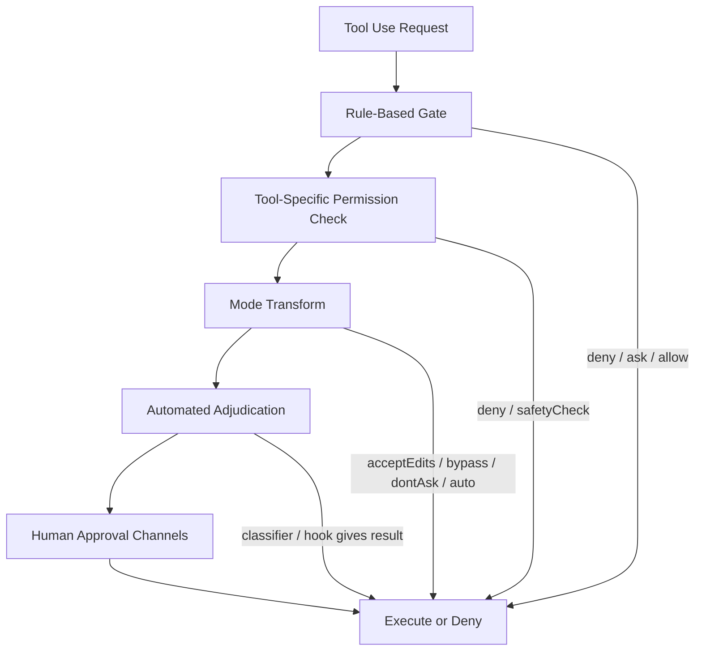

## 三. 交互

下面我想从将 claude code 视为 CLI **产品**的角度出发，看看能从其交互式系统中学习到哪些可以借鉴的思维
首先从宏观上我分为三层
1. - CLI命令与模式分流层：用户如何从外部进入系统，并被分流到正确的执行模式
2. - 终端渲染层：运行时状态如何被声明式地渲染为终端 UI
3. - 状态层：状态本身如何被组织、隔离和驱动更新
### 1. CLI命令与模式分流层

首先最外层是关注如何从**外部**进入 claude code，同时分流到正确的执行模式（至于 claude code 中例如 /theme 等等是属于 内部命令，在“应用基础设施层”展开）
我认为这一层可以学习的是其如何尽可能多实现**复用**的设计。因为 claude code CLI 支持的命令参数有很多，如何将可复用的内容固定、对差异处进行可维护的管理，想必也是各位大佬写代码很关注的一件事情
#### **通过“参数改写 + 暂存态”实现入口收敛复用**

实现方式：先在 main() 很前面解析特殊输入，把**信息**存进 _pendingConnect、_pendingAssistantChat、_pendingSSH，必要时直接改写 process.argv，然后继续走默认主流程。
	- 复用了 cc:// 的 interactive 入口：不是单独再做一套“直连 TUI 启动器”，而是把 URL 暂存后继续走默认 claude [prompt] 主线，后面统一进入 launchRepl(...)。
	- 复用了 cc:// + -p 的 headless 入口：不是重新实现一套 headless 直连解析，而是把它改写成内部 open <cc-url> 子命令，复用已有 open 处理逻辑。
	- 复用了 claude assistant [sessionId] 的交互入口：把 assistant 从 argv 里剥掉，后面仍走主交互路径，而不是再维护一套独立 UI 启动链。
	- 复用了 claude ssh <host> [dir] 的交互入口：先抽取 host/dir/flags 到 _pendingSSH，后面再在主 action 里统一决定怎么进入 REPL。
#### **通过“生命周期钩子”实现公共初始化复用**

实现方式：用 program.hook('preAction', ...) 把所有外层命令**共享的前置步骤挂成统一生命周期**，而不是散落在每个命令的 .action(...) 里。
	- 复用了 init()：默认命令和各类子命令都共用同一套基础初始化。
	- 复用了 logging sinks 初始化：避免每个子命令自己补日志接线。
	- 复用了 migration 流程：通过 runMigrations() 统一执行，而不是每个命令各自判断。
	- 复用了 remote settings / policy limits 的预热加载：命令层统一做，后面的 action 只拿结果。
	- 复用了 entrypoint 标记逻辑：initializeEntrypoint(...) 统一设置 CLAUDE_CODE_ENTRYPOINT，而不是每条分支各写一遍。
#### **通过“统一命令容器 + 委托处理器”实现命令框架复用**

实现方式：整个外层 CLI 只有一个 CommanderCommand 根对象，默认命令和子命令都挂在**同一棵命令树**下；复杂子命令再把具体逻辑**委托**给外部 handler。
也就是说命令层只做了组织和分发，复杂的执行并不会耦合在其中而是交给专门处理器
Simple 单一职责原则
	- 复用了 Commander 的解析/帮助/选项继承能力：比如 help 配置、根级 option、preAction 生命周期，不需要每个子命令重复造壳。
	- 复用了默认命令和子命令的统一注册机制：program.argument(...).action(...) 和 program.command(...).action(...) 都挂在同一个程序骨架上。
	- 复用了 handler 模块：例如 mcp 系列子命令在命令树里只负责路由，实际执行交给 cli/handlers/*，这样 main.tsx 不需要塞满业务细节。
	- 复用了命令注册片段：像 registerMcpAddCommand(...) 这种，把某一组子命令注册逻辑抽出来复用，而不是在 main.tsx 手写到底。
#### **通过“共享状态载体 + 启动契约”实现模式分流复用**

实现方式：把跨阶段要共享的数据装进统一对象，再让**多个模式分支共用同一套启动接口和上下文**。
	- 复用了 Pending* 状态对象：早期 argv 预处理阶段和后面的默认 action 阶段，不直接相互耦合，而是通过 _pendingConnect / _pendingSSH / _pendingAssistantChat 传递状态。
	- 复用了 sessionConfig：continue、resume、direct connect、ssh remote、remote 等交互分支，都尽量从同一个基础配置对象出发，只覆盖少量差异字段。
	- 复用了 resumeContext：多个恢复相关路径共享同一份恢复上下文，而不是每个恢复分支各自重新拼上下文。
	- 复用了 interactive 启动骨架：createRoot(...) -> showSetupScreens(...) -> launchRepl(...) 这条链，被多种交互模式共用。相关 helper 在 interactiveHelpers.tsx 和 replLauncher.tsx。
	- 复用了 headless 启动准备：虽然最后走的是 runHeadless(...)，但前面的 setup()、env 应用、hooks 启动、校验逻辑，和 interactive 共享了大量准备阶段。
### 2. 终端渲染层

从终端进入对话之后，问题就是：如何渲染
	- 浏览器中如果是 React 应用那么就是通过：React FiberTree -> React DOM -> Real DOM -> Browser
	- cc 的 TUI 是走的：React FiberTree -> Ink DOM -> Yoga Layout -> Screen Buffer -> Terminal
可以看到在 **render 的 reconcile** 阶段，React 仍然用同一套 Fiber/reconciliation 机制计算更新，例如像递归收集flags、diff计算等等；到了 **commit** 阶段，不再由 React DOM 把更新提交到浏览器 DOM，而是由 **Ink** 作为 **renderer** 把更新提交到它自己的终端宿主节点树，再交给 Yoga 做布局并输出到 terminal
#### React => Ink DOM

在 ink/ink.ts 中以 Ink.render(node) 为入口，调用 `react-reconciler` 的 `updateContainerSync + flushSyncWork`，触发 React 的 reconcile 中 beginWork递、completeWork归 收集flags
在 ink/reconciler.ts 中，Ink 通过 createReconciler 方法注册了一整套 host 方法，把 React 在 **commit 阶段**产生的宿主操作，逐条映射为对 **Ink DOM** 的 mutation，并同步 **Yoga 节点状态**（如 style、display、子节点结构等）
> **HostConfig** 是提供给 React 的一个**对象**，通过对象中提供的一系列**方法**，告诉 reconciler 在目标宿主环境里“怎么创建节点、怎么挂子节点、怎么更新、怎么提交”。这个宿主环境可以是 DOM、canvas、console，也可以是终端 UI
> Ink HostConfig 就相当于 React 在 终端环境 中的一个**适配器**
Ink HostConfig 对象包含的方法有如
	- `createInstance / createTextInstance`：创建 Ink DOM 节点（并按需创建/配置 Yoga 节点）
	类似于在浏览器中 display: none 的DOM节点是不配在布局树中拥有节点的，`ink-virtual-text` / `ink-link` / `ink-progress`这几类 Ink DOM 节点无需创建对应的 Yoga 节点
	- `appendChild / insertBefore / removeChild`：维护 Ink DOM 树结构，同时维护 Yoga child 列表（注意无 Yoga 节点的 child 会影响索引映射）
	- `commitUpdate / commitTextUpdate`：把 props/text 变更写入 Ink DOM；对影响布局的 style/display 等变更同步到 Yoga 节点状态（例如 `applyStyles`、`setDisplay`） -（初次挂载时）`createInstance` 内部会遍历 props 做初始化写入（Ink 内部用 helper 处理不同 prop 类别）
在 commit 的收尾时有一个钩子，会触发
1. - rootNode.onComputeLayout()
2. - rootNode.onRender?.()
这两条分别对应下面的 
	- Yoga Layout
	- 调度 frame render 使用新的 computed layout 画进 screen buffer
从 2 是在 1同步执行 之后，确保了消费数据是在数据更新之后，这也就是为什么是 Yoga Layout => Screen Buffer
> 有点像浏览器的**单线程**事件循环中 JS 执行DOM影响布局信息会**同步阻塞** HTML 解析
#### Commit 后 Yoga Layout

这一层主要聚焦于在拿到前面输入得到的元素几何信息计算“几何树”，包含每个 Yoga节点 的盒模型信息等等
我们可以主要关注其在性能优化方面的处理：类似于 React FiberTree 中有 **didReceiveUpdate **字段实现 eagerState、bailout 等性能优化策略，cc 通过 dirty 和 measure 细化了重渲染的粒度，实现了尽可能多的节点复用
	- dirty（Ink DOM）**: DOMElement.dirty**，决定 paint 阶段能否直接 blit 复用上一帧像素；`dirty=false` 允许快路径，`dirty=true` 迫使该子树重画
> blit: Block Image Transfer 块拷贝，在图形系统中表示将一块已经画好的像素区域直接复制到另一个地方，而不是重新绘制一遍。在 cc 的 TUI 场景中表示 把上一帧 screen buffer 里的一块 cell 矩形，直接复制到这一帧
	- measure（Yoga）: `ink-text/ink-raw-ansi` 这两类特定节点通过 `setMeasureFunc` 参与 Yoga 尺寸求解；当 Ink 在 `markDirty` 中对这些节点触发 `yogaNode.markDirty()` 时，会让 commit 后的 `calculateLayout` 重新进行昂贵的文本测量与换行推导
1. - 尽可能避免 dirty
 1. - `children`** 不参与 attribute 更新**
  因为 React 会给 `children` 传新引用；如果当 attribute，会导致每次都 `markDirty`。
 2. - `style`** 做值相等比较，避免每 render 触发 dirty**
  React 经常每次 render 都 `style={{...}}` new object。Ink 在 `setStyle` 里做 shallowEqual，避免无意义 `markDirty`
2. - **makeDirty** **只**对需要 re-measure **叶子**（确保是第一次遇到的）也就是我上面提到的 ink-test、ink-raw-ansi 两类节点触发 Yoga dirty
 ```typescript
 if (
   !markedYoga &&
   (current.nodeName === 'ink-text' || current.nodeName === 'ink-raw-ansi') &&
   current.yogaNode
 ) {
   current.yogaNode.markDirty()
   markedYoga = true
 }
 ```
 实现只有在 文本节点变动 才会把 脏标记 “打穿”触发昂贵的 measure
> 或许可以借鉴 [https://github.com/chenglou/pretext](https://github.com/chenglou/pretext) 思路优化 measure 过程？但是终端环境没有canvas环境并且测量对象一个是像素宽度一个是cell宽度，所以有人建议给 `prepare()` 加可插拔 `measure`，改成用 `string-width` 这类 cell 计数函数，具体可看[https://github.com/chenglou/pretext/issues/34](https://github.com/chenglou/pretext/issues/34)
#### Yoga Layout => Screen Buffer

当 Yoga 的 computed layout 已经可读后，renderer 开始消费这棵由 Ink DOM + Yoga node 组成的布局树（如果布局不存在的话会做防御，返回空frame，等到下次触发时再更新）
首先以 createRenderer 为入口，和 React 一样也用了 ping-pong **双缓冲**，目的是实现复用 Output实例（保留charCache等跨帧缓存）以降低分配与重复解析成本，然后通过布局树中根节点的 computed 尺寸确定本帧 screen 的宽高
接着进入核心递归 renderNodeToOutput ，对每个节点读其 computed rect ，判断当前节点子树能否复用上一帧对应矩形，具体用到的就是上一步拿到的 dirty 标记`若 node.dirty=false 且 rect 未变且 prevScreen 存在`那么就直接 blit 复用
核心思想和**虚拟树**一样，都是要通过先在**内存**中处理避免昂贵的开销，例如在 cc 的 TUI 中要避免的就是频繁触碰终端 I/O ，于是先将渲染结果落到**内存**中，和上一帧做比较、尽可能复用，为下一层基于 `Screen` 计算最小 patches 并写入终端做准备
#### Screen => Terminal

LogUpdate 将 prevFrame, frame.screen => 终端变更的最小patch序列
`writeDiffToTerminal` 把 patch 列表变成一次或少数几次 `stdout.write(...)`，并按终端能力决定是否包裹 **DEC 2026 同步输出**（BSU/ESU）来避免闪烁/撕裂
在交互上的体验优化措施可以归纳为：
	- **把 diff 的副作用压缩成少量 write**（减少 I/O 调用和终端重绘抖动）
	- **在支持时用同步输出保证原子性**（避免用户看到中间态）
	- **在不支持/被 tmux 破坏原子性时跳过**（避免徒增开销或错误行为）
### 3. 状态层

在知道状态如何驱动渲染更新后，现在聚焦于状态是怎么管理的
cc 并不是直接只用一个大的全局store例如 Redux 一口气收口所有状态
而是将状态按照 **频率**和**职责** 拆开了
	- 实现了 高频脏数据 与 低频共享壳层 的区分，防止高频刷新时无效的性能耗散
	- 像 React16 引入 Scheduler 一样，**缩小了更新的颗粒度**，实现了例如 messagesRef 这种需要立即可读的状态 不用等 React batching（在"REPL本地"中详细展开）
	- 并且职责不同决定了生命周期的不同，像 AppState是会话session级别，REPL本地状态是当前REPL实例级别的
拆分为下面三种状态，最后再统一交给 React+Ink 渲染
#### 全局store

全局 store 也就是 **AppState** ，承载的是会话级、共享的交互壳层状态，例如共享 UI、权限模式、MCP、插件、任务视图、footer、通知等。
在 main.tsx 中准备了 initialState ，由 launchRepl 传入到 App 后挂在了 AppStateProvider 上，这也就印证了我上面说的 AppState是顶层、会话级别的
AppStateProvider 放进 Context 的不是不断变化的 AppState，而是稳定的 store 引用，从而避免 Context value 变化导致整棵树级联重渲。
其底层实现是基于**观察者模式**：
```typescript
type Store<T> = {
  getState: () => T
  setState: (updater: (prev: T) => T) => void
  subscribe: (listener: Listener) => () => void
}
```
当 setState 更新 store 后，会通知订阅者；React 侧再通过 Context + useSyncExternalStore + selector 订阅并读取切片，只有选中值真正变化的组件才会重渲。
同时，onChangeAppState 作为 AppState 副作用的统一收口层，负责把持久化、模式同步、环境刷新等系统行为集中处理。
#### REPL本地

本地状态管理的是高频且强时序的状态，最核心的是 messages、streaming text/tool use、输入框、overlay、滚动相关。这些**更新极高频**，而且强依赖当前 REPL 生命周期，所以放在本地
正由于其高频更新的特性， cc 通过 useState + useRef 去维护，确保读取到的是**最新值**
以 messages 为例 REPL.tsx (line 1182)
```typescript
const [messages, rawSetMessages] = useState<MessageType[]>(initialMessages ?? []);
const messagesRef = useRef(messages);
const setMessages = useCallback((action: React.SetStateAction<MessageType[]>) => {
  const prev = messagesRef.current;
  const next = typeof action === 'function' ? action(messagesRef.current) : action;
  messagesRef.current = next;

  if (next.length < userInputBaselineRef.current) {
    userInputBaselineRef.current = 0;
  } else if (next.length > prev.length && userMessagePendingRef.current) {
    const delta = next.length - prev.length;
    const added =
      prev.length === 0 || next[0] === prev[0]
        ? next.slice(-delta)
        : next.slice(0, delta);

    if (added.some(isHumanTurn)) {
      userMessagePendingRef.current = false;
    } else {
      userInputBaselineRef.current = next.length;
    }
  }

  rawSetMessages(next);
}, []);
```
1. - messages 给 React 渲染用。
2. - messagesRef 给“同步立即读取最新值”的逻辑用。
> 对action做束口这部分有点像 Reducer模式 ？我记得 useReducer 和 useState 本质区别就是处理函数一个是自定义的一个是React定义的
#### 外部store

管理**跨 React/非 React** 的流程状态，像命令队列、QueryGuard、任务文件 watcher 都属于这类。它们既要被 React 订阅，又要被非 React 代码同步读写，所以独立出来最干净
具体实现是通过 模块级真相源 (如commandQueue等) + 订阅通知 + useSyncExternalStore 桥接 React
在 signal.ts 中通过 createSignal 维护 listener 集合
```typescript
export function createSignal<Args extends unknown[] = []>() {
  const listeners = new Set<(...args: Args) => void>()
  return {
    subscribe(listener) {
      listeners.add(listener)
      return () => listeners.delete(listener)
    },
    emit(...args) {
      for (const listener of listeners) listener(...args)
    },
    clear() {
      listeners.clear()
    },
  }
}
```
listener集合会在变化时 emit，本质仍然是观察者模式，它并不负责存储状态快照，更像是负责管理订阅、广播事件的代理者，真正的外部 store 是在它上面再包一层自己的状态和 getSnapshot()
例如像命令队列commandQueue
```typescript
const commandQueue: QueuedCommand[] = []
let snapshot: readonly QueuedCommand[] = Object.freeze([])
const queueChanged = createSignal()
```
其中 commandQueue 是真实可变数据，**snapshot** 是提供给 **React** 的只读快照，queueChanged 负责在队列变化时通知订阅者。React 侧通过 useSyncExternalStore(subscribe, getSnapshot) 订阅它；而非 React 代码则可以直接调用 enqueue、dequeue、peek 等同步 API 读写这份模块级状态。

## 四. 安全

上面在讲交互、状态、工具时，其实已经不断碰到 cc 的一个核心前提：
它不是像很多“托管沙箱式”AI 编程产品那样，先在隔离环境里生成代码、再由人把结果合并回本地；Claude Code 是直接拿到你的终端、当前工作目录、配置文件、MCP、插件和会话上下文去行动。

这带来了一个很重要的设计变化：
它的安全体系重点，不是“把模型关进完全隔离的盒子里”，而是“在真实环境里，让每一次动作都经过足够细粒度、可回退、可审计、可灰度的权限决策”。

所以如果要学习 claude code 的安全设计，我觉得不应该再把它理解成一个“六层串行验证器”，而应该理解成下面三条主线：
1. - **权限决策管线**：一个工具调用从提出请求到被允许/拒绝，中间经过哪些检查、哪些检查可以提前返回
2. - **模式状态机**：不同 permission mode 如何改变同一条命令的处理方式，以及模式切换时上下文如何同步变化
3. - **审批通道编排**：用户的批准并不只来自本地终端弹窗，而是来自本地 UI、远端 bridge、channel relay、hook、异步 classifier 等多个并发通道

为了避免把“设计”和“猜测”混在一起，这里我主要依据这些文件来理解：
- `src/utils/permissions/permissions.ts`
- `src/tools/BashTool/bashPermissions.ts`
- `src/utils/bash/ast.ts`
- `src/tools/BashTool/bashSecurity.ts`
- `src/hooks/toolPermission/handlers/interactiveHandler.ts`
- `src/utils/permissions/permissionSetup.ts`

### 1. 先从威胁模型看：cc 到底在防什么

如果只是把这套系统理解成“危险命令要二次确认”，其实会低估很多设计细节。cc 实际上在同时防下面几类风险：
1. - **命令注入 / parser differential**：模型输出的 shell 字符串，看起来像一个命令，但 shell 真正执行时可能不是你肉眼看到的那样
2. - **规则绕过**：用户自己配置的 allow 规则如果过宽，可能会把 classifier 整个架空
3. - **危险路径写入**：像 `.git/`、`.claude/`、shell config、关键系统目录，不能因为“当前是 bypass/auto 模式”就直接放行
4. - **组合命令上下文风险**：单条子命令看起来安全，但放进 `cd && git`、pipe、redirect、compound command 里之后，风险含义会变化
5. - **子代理失控**：Agent 工具如果被过宽授权，会绕过上层对 delegation 的安全约束
6. - **远程审批竞态**：本地终端、远端 UI、消息通道、异步 classifier 都可能对同一个 permission request 作出响应
7. - **headless 场景失控**：无头代理没法弹窗时，如果没有 fail-closed 兜底，就会出现“无法询问用户但仍继续执行”的风险

也就是说它防的不只是“rm -rf /”这种直观危险，更是在防“安全策略本身被架空”。

### 2. 主体不是六层串行，而是一条可提前返回的决策管线

如果按源码去看，`hasPermissionsToUseTool(...)` 和 `bashToolHasPermission(...)` 这两条路径的核心特征不是“每一层都一定执行”，而是：
**很多检查都可以提前结束流程**。



所以更准确的说法不是“六层线性防御”，而是：
它是一个 **DAG 式权限决策系统**，包含若干个可能提前返回的 gate。

#### 2.1 规则系统不是简单 allow/deny，而是带 provenance 的策略系统

在 `permissions.ts` 和 `types/permissions.ts` 里，权限规则并不是一个单纯的布尔表，而是带来源的：
- `userSettings`
- `projectSettings`
- `localSettings`
- `policySettings`
- `flagSettings`
- `cliArg`
- `session`
- `command`

这背后很值得学的一点是：
**安全决策不仅要知道“命中了什么规则”，还要知道“这个规则从哪来”**。

因为规则来源不同，后续行为也不同：
1. - 有的规则可以持久化编辑
2. - 有的规则是 policy 下发，不能随便删
3. - 有的规则只在 session 内临时生效
4. - 有的规则来自 CLI 参数，只应该影响当前进程

这比“allowlist / denylist”要更像一个带 provenance 的策略系统。

另外，shell 规则匹配也不应写成“支持正则”。
对用户可见的形态，更准确的是三种：
1. - exact：精确命令
2. - prefix：`npm run:*` 这种前缀规则
3. - wildcard：带 `*` 的通配规则

内部会编译成 regex 去匹配，但**用户面对的抽象不是正则系统**。

#### 2.2 tool-specific permission check 才是真正体现“工具语义”的地方

外层规则系统只知道“这个工具/这个命令大概该不该放行”，
真正理解工具语义的，是工具自己的 `checkPermissions(...)`。

其中最复杂的是 Bash：
- 它不只是判断“是不是 Bash”
- 还会继续分析 subcommand、operator、redirection、path、sandbox、compound command

也就是说，cc 的权限系统不是单层 policy engine，而是：
**通用规则层 + 工具内语义层** 的组合。

#### 2.3 mode 不是 UI 标签，而是权限语义转换器

`PermissionMode` 在这里不是“界面模式”，而是真实改变决策逻辑的状态机：
- `default`
- `plan`
- `acceptEdits`
- `dontAsk`
- `bypassPermissions`
- `auto`

例如：
1. - `dontAsk` 会把原本的 `ask` 转成 `deny`
2. - `acceptEdits` 会对一部分文件系统命令直接走 fast-path
3. - `bypassPermissions` 虽然很强，但仍然不能覆盖某些 `safetyCheck`
4. - `auto` 会调用 transcript classifier，不再只是弹窗等用户

这点很值得学习：
**模式切换不是切 UI，而是切权限语义**。

#### 2.4 `safetyCheck` 是 bypass-immune 的硬防线

源码里有一个非常关键的术语：`safetyCheck`。

它代表的是某些风险即使在宽松模式下也不能直接绕过，例如：
- `.git/`
- `.claude/`
- shell config
- 危险删除路径

在 `permissions.ts` 里，这类结果会被单独拎出来处理；即使在 bypass 路径里，也不会像普通 allow/ask 那样被一把跳过。

这说明 cc 的设计不是“有一个超级管理员模式，万物直通”，而是：
**有些风险属于系统级硬边界，模式只能影响大多数流程，不能抹掉全部边界**。

这个设计我觉得非常成熟，因为它防的是“你为了方便，把整个系统的牙都拔掉”。

### 3. Bash 是最大的安全面，所以用了双轨分析

如果要从源码里挑一个最值得学习的安全面，我觉得就是 Bash。
因为 BashTool 其实是整个系统里最接近“把宿主机直接交给模型”的能力。

#### 3.1 AST 路径的重点不是“解析语法树”，而是“能否可信提取 argv”

在 `src/utils/bash/ast.ts` 里，注释写得很清楚：
它的目标不是构建一个 shell sandbox，而是回答一个更窄但更关键的问题：
**我们能不能可信地为这条命令提取出 simple command 的 argv[]？**

这背后的思想很漂亮：
1. - 如果能可信提取，后面就可以做更强的 prefix / path / subcommand / redirect 安全分析
2. - 如果不能可信提取，就不要自作聪明，直接走 `too-complex -> ask`

所以这条 AST 路径真正的关键词是：
- allowlist
- fail-closed
- trustworthy argv extraction

不是“树更高级”，而是“只有在结构可证明可信时才自动化决策”。

#### 3.2 它不是只靠 AST，而是 AST 优先 + legacy validator 兼容兜底

你原来把这一层写成“注入检测层，30+攻击特征匹配”，这个说法只说对了一半。

更准确的说法是：
cc 在 Bash 安全上走的是 **双轨安全分析**：
1. - **AST 路径优先**：优先用 tree-sitter 风格的结构化分析，判断命令是否属于“可可信分析”的简单结构
2. - **legacy validator 兜底**：如果 AST 不可用、shadow mode 下不生效、或者命令需要兼容旧路径，就继续使用 `bashSecurity.ts` 里的 regex / shell quote / pattern battery

也就是说，旧逻辑并没有被简单删除，而是变成兼容兜底层。

这很值得学，因为很多系统在“新安全模型上线”时容易犯的错是：
一刀切替换旧逻辑，结果出现灰度期盲点。

而 cc 的做法更像：
**先让新路径成为主判断，再用 shadow mode 和 legacy fallback 保持迁移安全性**。

#### 3.3 它防的不只是“危险命令”，还防“拆分分析带来的认知偏差”

这里有两个很能说明问题的例子。

第一个例子是：
```bash
echo hi | xargs printf '%s' >> file
```

如果你只是把 pipe 两边拆开看，会觉得：
1. - `echo hi` 很安全
2. - `xargs printf '%s'` 也不算特别危险

但真正危险的信息在原始命令的 `>> file` 上。
所以 `bashPermissions.ts` 里会在 operator/subcommand 分析之后，再回头检查原始命令的 redirection 和 path constraint。

这点特别值得学：
**局部子命令安全，不等于整体命令安全**。

第二个例子是：
```bash
cd malicious && git status
```

单看 `git status` 是个近乎只读命令，但放进 `cd ... && git ...` 的上下文里，它可能进入一个恶意仓库目录，从而触发额外风险。

所以这里真正被防的不是“git status 危险”，而是：
**组合命令上下文改变了原本工具语义**。

也就是说 cc 的设计不是只看 token，而是在努力恢复“执行时语义”。

### 4. 沙盒不是简单白名单，而是一个 shortcut

你原来的“沙盒自动允许层”可以保留，但要换一种解释方式。

更准确的说法是：
**沙盒并不是把系统变安全的唯一边界，而是在确认命令会进入 sandbox 的前提下，为一部分命令提供 shortcut**。

这背后有两个细节非常重要。

#### 4.1 auto-allow with sandbox 的前提是“真的会进 sandbox”

`shouldUseSandbox(...)` 不是一个装饰性的判断，它决定了后续能不能走 sandbox auto-allow 快路径。

如果命令：
1. - 显式要求禁用 sandbox
2. - 命中 excluded command
3. - 当前环境根本没启用 sandbox

那它就不会进入这个 shortcut，而会继续走正常权限决策。

所以“在沙盒里就自动允许”的准确语义应该是：
**在已经确认该命令会被沙盒约束时，可以减少一次用户确认**。

#### 4.2 `excludedCommands` 在源码里明确不是安全边界

这点很值得单独写出来。

在 `shouldUseSandbox.ts` 里有一句注释非常直白：
`excludedCommands is a user-facing convenience feature, not a security boundary.`

这说明作者对安全边界画得很清楚：
1. - 真正的安全边界是 sandbox permission system
2. - `excludedCommands` 只是配置便捷项，不应该被误解为安全机制本身

这其实是很多系统设计里容易被忽视的点：
**方便用户的开关，不等于真正的安全边界**。

### 5. “AI 分类器”其实有两类，而且源码能证实的内容要谨慎说

这部分尤其值得修正，因为最容易把“产品叙述”“猜测”“当前源码”混成一团。

#### 5.1 Bash prompt classifier 更像命令级 allow/ask/deny 判断

在 Bash 这边，classifier 主要是围绕命令级匹配在工作的：
- allow descriptions
- ask descriptions
- deny descriptions

它更像是在说：
“这条 Bash 命令是否符合某一类可描述的允许/询问/拒绝模式”

也就是说它更像一个 **命令级审批器**，而不是一个抽象的全局风险分引擎。

#### 5.2 auto-mode transcript classifier 更像动作审裁器

`yoloClassifier.ts` 这一路则更像是在回答另一个问题：
**结合当前对话、工具动作、上下文，auto mode 下这一步动作是否应该被放行？**

所以这边更像一个：
**动作级 adjudicator**

它的输出心智模型也更接近：
- allow
- block
- unavailable

而不是你原文里写的那种固定“0-1 风险分 + 阈值表”。

#### 5.3 当前仓库里，能直接证实的和不能直接证实的要分开写

这点非常重要。

当前仓库里的 `src/utils/permissions/bashClassifier.ts` 是 external stub，所以像下面这些说法，如果要写进学习笔记，就要非常谨慎：
- “输出 0-1 风险分”
- “阈值 0.95 / 0.5”
- “100万+历史命令训练数据”

这些并不是当前这份源码能直接证实的事实。

如果写成笔记，更稳妥的写法应该是：
1. - 源码能够证实：存在 classifier 接口、存在 allow/ask/deny 的分类式调用点、存在 auto-mode classifier
2. - 源码不能直接证实：具体打分形式、训练集规模、固定阈值表

这其实也是一个很值得学习的方法论：
**做源码学习时，要区分“我看到的实现”与“我推测的产品内部细节”**。

### 6. mode 状态机最值得学的不是枚举值，而是“切换时发生了什么”

如果只是列一个 mode 表：
- default
- plan
- acceptEdits
- dontAsk
- bypassPermissions
- auto

其实还没抓到重点。

真正值得学的是：
**mode transition 不只是换个状态值，而是会触发上下文变换**。

#### 6.1 auto mode 不是简单开关，而是会“自净化”权限上下文

在 `permissionSetup.ts` 里，一个非常漂亮的设计是：
当进入 auto mode 时，系统会主动剥离那些会绕过 classifier 的危险 allow 规则，例如：
- `Bash(*)`
- `Bash(python:*)`
- `Agent(*)`

等离开 auto mode 再恢复。

也就是说，cc 不是天真地说：
“你已经开了 auto，那就直接拿现有规则继续跑”

而是进一步意识到：
**有些用户自己配置的 allow 规则，会把 auto mode 最核心的 classifier 直接架空**

所以进入 auto mode 时，先清洗一遍权限上下文。

这个设计非常值得学，因为它体现了：
**系统不仅防模型，也防“过去为了方便留下的过宽策略”**。

#### 6.2 bypass 也不是“上帝模式”

另一个很值得强调的点是：
很多人看到 `bypassPermissions` 会直觉地认为它等于“跳过全部检查”。

但从源码看并不是这样。

像前面提到的 `safetyCheck`，就是 bypass-immune 的。
这意味着：
**bypass 是对大多数 permission prompt 的跳过，不是对所有安全边界的删除**。

这类设计的好处是：
哪怕给了高级用户更强控制权，系统仍然给自己保留了一层“最后的牙”。

### 7. 审批不是一个弹窗，而是一组并发竞争的通道

如果只看表面 UI，很容易把 cc 的权限确认理解为：
“弹出一个 dialog，用户点 yes/no”

但在 `interactiveHandler.ts` 里，整个审批过程更像一个并发编排系统。

它至少有这些响应来源：
1. - 本地终端 UI
2. - CCR remote bridge
3. - channel relay
4. - PermissionRequest hooks
5. - 异步 Bash allow classifier

这些通道之间不是串行排队，而是 **race**：
谁先给出有效决策，谁就赢。

这个设计我觉得特别像一个现实系统，而不是“理想化的单线程审批器”。

因为在真实产品里，用户可能：
1. - 在本地点了允许
2. - 同时远端网页也点了允许
3. - 或者 classifier 在用户操作前就自动批准了

所以系统必须解决的是：
**多个审批来源对同一个请求的竞态一致性**。

这已经不是“权限弹窗 UI”层面的设计了，而是一个小型并发协调问题。

### 8. headless agent 的安全处理特别值得看

很多工具在交互模式下做得还行，一到 headless / background / subagent 就开始偷懒：
既然没法问用户，那就“默认继续”或者“随便失败”。

cc 在这块的处理反而很有代表性。

它的思路大致是：
1. - 如果当前上下文不能弹出 permission prompt
2. - 那就先跑 `PermissionRequest` hooks，看有没有自动 allow/deny
3. - 如果 hooks 也没给结论，就直接 fail-closed

也就是说它在 headless 场景下选择的是：
**先尝试自动化政策判断，如果还不够确定，就拒绝，不赌运气**。

这点特别能说明 cc 的安全观：
它不是“尽量让 agent 跑下去”，而是“尽量在不越线的前提下让 agent 跑下去”。

### 9. 这不是静态规则系统，而是一个可运营的安全系统

我觉得 claude code 在安全方面最让我觉得成熟的一点，不是规则写得多，而是它明显在按“可运营系统”的思路做安全。

比如源码里能看到很多这类设计：
1. - **shadow parse**：先观测新 AST 路径和旧路径是否分歧，而不是一上来全量切
2. - **feature gate / killswitch**：发现问题能快速关掉
3. - **denial tracking**：auto mode 下连续拒绝过多，会转回 prompting，而不是一直盲拒
4. - **classifier dump / telemetry**：classifier 失败时可以保留上下文做排查
5. - **fail-open 与 fail-closed 的区分**：有些情况回退到人工审批，有些情况直接拒绝

这背后体现的其实是：
**安全不是靠一组永远正确的静态规则，而是靠一套可以灰度、观察、回滚、修正的演进机制**。

对于工程系统来说，我觉得这比“列出很多危险模式”更值得学。

### 10. 如果把这一节浓缩成几个最值得学的设计点

最后如果让我把这一节再浓缩成几个可以复用到自己系统里的知识点，我会记下面这几条：

1. - **把“能否可信分析”与“是否允许执行”拆开**
   `ast.ts` 先判断能不能可信提取 argv，不能就 fail-closed，这比直接在不可靠字符串上硬做规则匹配稳得多。
2. - **权限规则一定要带来源**
   不然你只知道“命中了规则”，却不知道这个规则该不该删、能不能持久化、是不是 policy 下发的。
3. - **模式切换要联动上下文变换**
   进入 auto mode 时主动剥离会绕过 classifier 的规则，这种“模式切换伴随策略自净化”的设计非常高级。
4. - **局部安全不等于整体安全**
   pipe、redirect、compound command、`cd && git` 这些都说明：子命令安全，不代表整条命令安全。
5. - **审批系统本质上是并发协调系统**
   本地、远端、channel、hook、classifier 可能同时返回结果，真正难的是保证只有一个结果生效。
6. - **真正成熟的安全系统必须可运营**
   有 shadow、有 gate、有 killswitch、有 telemetry、有 fallback，才能在真实产品里长期演进。

如果说前面几章更多是在看 claude code 如何做“交互式 agent 产品”，那么这一章让我感受到的则是：
它并不是简单把大模型接进终端，而是非常认真地把“模型获得执行权”这件事，当作一个需要长期运营和持续收缩风险边界的工程系统来设计。
